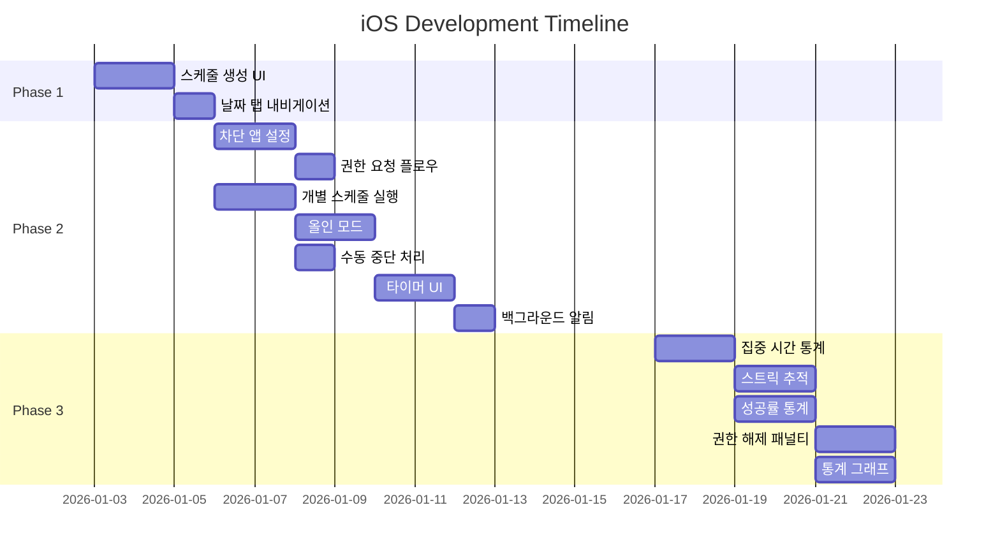
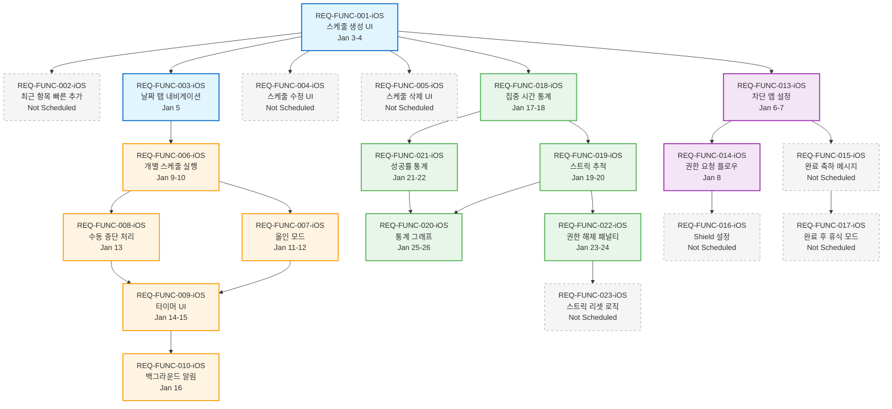
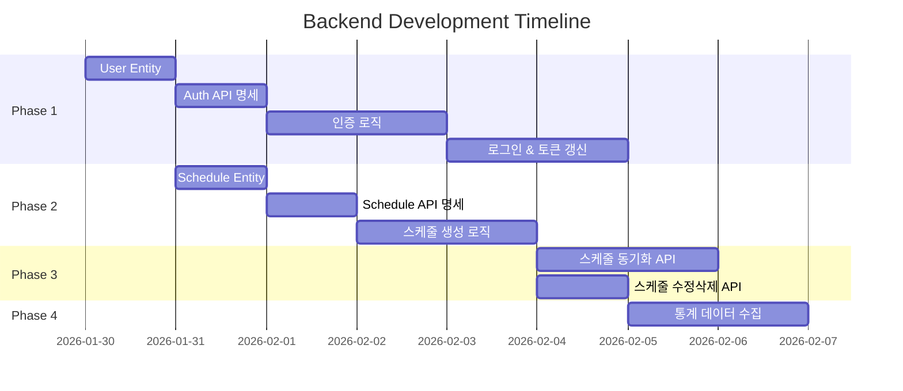
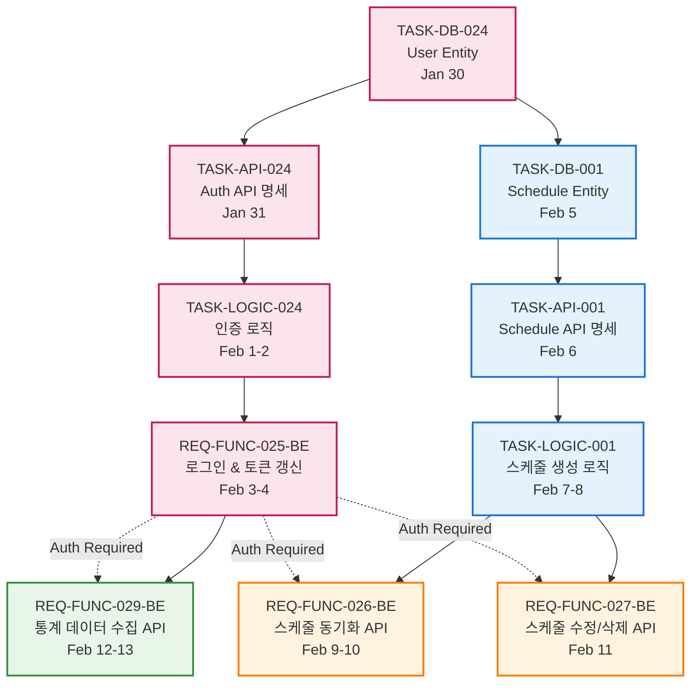

# Task Execution Strategy & Dependency DAG

**문서 버전:** 1.1  
**작성일:** 2026-01-05  
**프로젝트:** Unwind - Backend & iOS Application

---

## 1. 개요

### 1.1 목적
본 문서는 Unwind 프로젝트의 전체 작업(Task)을 두 개의 병렬 실행 흐름으로 분리하여, 효율적인 개발 전략과 의존성 구조를 정의합니다.

### 1.2 실행 전략 (Overview)

```
┌─────────────────────────────────────────────────────────────────┐
│                    Unwind 프로젝트 실행 전략                      │
└─────────────────────────────────────────────────────────────────┘

   Flow 1: Frontend UI PoC              Flow 2: Backend Core & AI
   ═════════════════════════           ═══════════════════════════
   📱 iOS Client (Jan 3-26)             🖥️  Spring Boot (Jan 30-Feb 13)
   
   ┌─────────────────────┐              ┌─────────────────────┐
   │ Phase 1: Foundation │              │ Phase 1: Auth       │
   │   (Jan 3-5)         │              │   (Jan 30-Feb 4)    │
   └─────────────────────┘              └─────────────────────┘
           ↓                                      ↓
   ┌─────────────────────┐              ┌─────────────────────┐
   │ Phase 2: Focus Mode │              │ Phase 2: CRUD       │
   │   (Jan 6-16)        │              │   (Feb 5-8)         │
   └─────────────────────┘              └─────────────────────┘
           ↓                                      ↓
   ┌─────────────────────┐              ┌─────────────────────┐
   │ Phase 3: Stats      │              │ Phase 3: Sync       │
   │   (Jan 17-26)       │              │   (Feb 9-11)        │
   └─────────────────────┘              └─────────────────────┘
           ↓                                      ↓
           └──────────────┐    ┌─────────────────┘
                          ↓    ↓
                  ┌───────────────────┐
                  │ Integration Test  │
                  │   (Feb 14-20)     │
                  └───────────────────┘
```

### 1.3 병렬 실행 원칙
- **Flow 1 (iOS):** 로컬 저장소(UserDefaults) 기반으로 UI/UX 및 핵심 로직(타이머, 차단) 선행 개발.
- **Flow 2 (Backend):** 데이터 모델링 및 API 개발 후반 투입.
- 각 플로우 완료 후 통합 테스트 수행.

---

## 2. Flow 1: Frontend UI PoC (iOS)

### 2.1 목표
- **기간:** 2026-01-03 ~ 2026-01-26 (24일)
- **목적:** 사용자 인터페이스 PoC 완성 및 로컬 기능 검증

### 2.2 Epic 분류
```yaml
EPIC_SCHEDULE_MGMT:  # 스케줄 생성, 조회, 수정, 삭제
  - REQ-FUNC-001-iOS, 002, 003, 004, 005
EPIC_FOCUS_MODE:     # 집중 모드 실행 및 앱 차단
  - REQ-FUNC-006-iOS ~ 012
EPIC_STATS:          # 통계 및 성과 추적
  - REQ-FUNC-018-iOS ~ 023
EPIC_SETTINGS:       # 앱 설정 및 사용자 경험
  - REQ-FUNC-013-iOS ~ 017
```

### 2.3 일정 및 의존성

#### 2.3.1 일정 (Gantt Chart)


#### 2.3.2 의존성 그래프 (DAG)


### 2.4 실행 순서 (Critical Path)
*세부 Task 목록은 생략 (Gantt Chart 및 DAG 참조)*

---

## 3. Flow 2: Backend Core & AI Implementation

### 3.1 목표
- **기간:** 2026-01-30 ~ 2026-02-13 (15일)
- **목적:** RESTful API 구현 및 데이터 영속성 확보

### 3.2 Epic 분류
```yaml
EPIC_AUTH:          # 사용자 인증 (DB-024, API-024, LOGIC-024, FUNC-025-BE)
EPIC_SCHEDULE_MGMT: # 스케줄 관리 (DB-001, API-001, LOGIC-001)
EPIC_SYNC:          # 데이터 동기화 (FUNC-026-BE, FUNC-027-BE)
EPIC_STATS:         # 통계 수집 (FUNC-029-BE)
```

### 3.3 일정 및 의존성

#### 3.3.1 일정 (Gantt Chart)


#### 3.3.2 의존성 그래프 (DAG)


### 3.4 실행 순서 (Critical Path)
*세부 Task 목록은 생략 (Gantt Chart 및 DAG 참조)*

---

## 4. 통합 시나리오 및 리스크

### 4.1 Frontend-Backend 연동
- **회원가입/로그인:** Feb 4 이후 (REQ-FUNC-025-BE 완료 시점)
- **스케줄 동기화:** Feb 10 이후 (REQ-FUNC-026-BE 완료 시점)
- **통계 전송:** Feb 13 이후 (REQ-FUNC-029-BE 완료 시점)

### 4.2 주요 리스크
- **iOS:** Screen Time API 권한 거부 (→ 안내 메시지 강화)
- **Backend:** Delta Sync 충돌 (→ LWW 전략)
- **통합:** 일정 지연 시 Optional 기능 제외하고 Must 기능에 집중

---

## 5. 다음 단계 (Next Actions)

### 5.1 즉시 실행 (Ready to Start)
1. **Flow 1:** REQ-FUNC-001-iOS (Jan 3 시작)
2. **Flow 2:** TASK-DB-024 (Jan 30 시작)

### 5.2 이슈 생성 (참고)
```bash
# iOS 이슈
gh issue create --title "[iOS] REQ-FUNC-001: 스케줄 생성" --body "..." --label "ios,must" --milestone "v1.0-MVP"
# Backend 이슈
gh issue create --title "[Backend] TASK-DB-024: User Entity" --body "..." --label "backend,must" --milestone "v1.0-MVP"
```

---

**참조 문서:** [SRS](./SRS.md), [PRD](./PRD.md)
