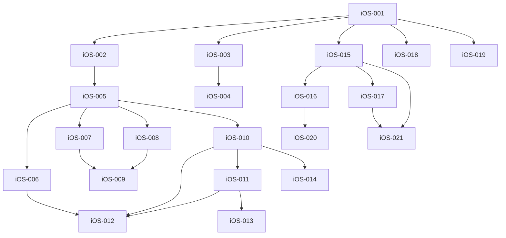
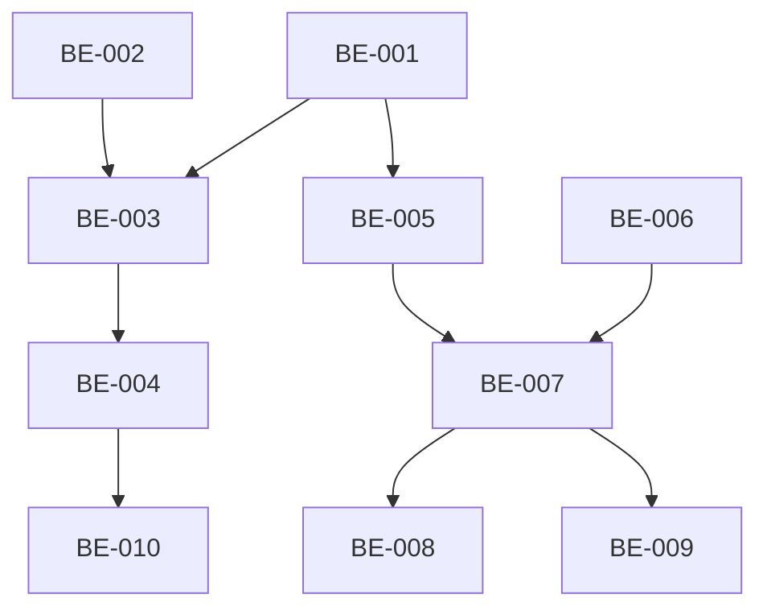

# GitHub Issue 실행 가이드

**문서 버전:** 1.1  
**작성일:** 2026-01-05  
**최종 수정:** 2026-01-05 (iOS 완료 반영)  
**프로젝트:** Unwind - Backend & iOS Application

---

## ⚠️ 중요: iOS 작업 완료 안내

**iOS 이슈 (iOS-001 ~ iOS-021) 전체가 별도 프로젝트에서 이미 완료되었습니다.**

- 본 문서의 iOS 관련 내용은 **참고용**으로만 활용하세요.
- GitHub에 이슈 생성 시 **Backend 이슈 (BE-001 ~ BE-010)만** 생성하시면 됩니다.
- iOS 이슈 파일들은 향후 참고를 위해 보관됩니다.

---

## 1. 개요

본 문서는 TASK_EXECUTION_DAG.md의 의존관계를 반영하여 생성된 GitHub 이슈들의 실행 순서와 병렬 개발 전략을 정의합니다.

### 1.1 이슈 넘버링 규칙

- **iOS 이슈**: `iOS-001` ~ `iOS-021` (총 21개) ✅ **완료됨**
- **Backend 이슈**: `BE-001` ~ `BE-010` (총 10개) 🔄 **진행 예정**
- 이슈 번호는 실행 순서를 반영하여 할당되었습니다.

---

## 2. iOS Flow 실행 순서 ✅ (완료됨 - 참고용)

> **주의**: iOS 작업은 모두 완료되었습니다. 이 섹션은 참고용으로만 활용하세요.

### 2.1 Phase 1: Foundation (2026-01-03 ~ 2026-01-05)

**순차 실행 (Critical Path):**
1. `iOS-001` - 스케줄 생성 UI 및 로컬 저장 구현 (Jan 3-4)
2. `iOS-002` - 날짜 선택 및 스케줄 목록 필터링 (Jan 5)

**병렬 실행 가능:**
- `iOS-003` - 차단 앱 관리 (FamilyActivityPicker) (Jan 6-7) ← 독립 실행 가능

**주요 마일스톤:**
- iOS-001 완료 시: 스케줄 생성/조회 기능이 완료되어 다른 기능의 기반이 됨

---

### 2.2 Phase 2: Focus Mode & Settings (2026-01-06 ~ 2026-01-16)

**의존관계 체인 1 (Focus Mode Core):**
1. `iOS-002` (완료 필요)
2. `iOS-005` - 개별 스케줄 실행 및 앱 차단 (Jan 9-10)
3. **분기 A:**
   - `iOS-006` - 앱 차단 화면 커스터마이징 (Jan 11-12)
4. **분기 B (병렬 가능):**
   - `iOS-007` - 스케줄 수동 포기 (Jan 13)
   - `iOS-008` - 타이머 종료 및 성공 처리 (Jan 14)
5. `iOS-009` - 타이머 UI 및 백그라운드 알림 (Jan 15-16) ← iOS-007, iOS-008 완료 후

**의존관계 체인 2 (Settings):**
1. `iOS-003` - 차단 앱 관리 (Jan 6-7)
2. `iOS-004` - 권한 요청 플로우 (Jan 8)

**의존관계 체인 3 (All-In Mode):**
1. `iOS-005` (완료 필요)
2. `iOS-010` - 올인 모드 진입 (Jan 15-16) ← iOS-005와 병렬 시작 가능
3. `iOS-011` - 올인 모드 진행률 (Jan 17)
4. `iOS-012` - 올인 모드 Shield UI (Jan 18-19) ← iOS-006도 완료 필요
5. **분기:**
   - `iOS-013` - 올인 모드 완료 (Jan 20) ← iOS-011 의존
   - `iOS-014` - 올인 모드 수동 포기 (Jan 21) ← iOS-010 의존

**병렬 실행 전략:**
- **Group A**: iOS-005 → iOS-006 → iOS-007 → iOS-008 → iOS-009
- **Group B**: iOS-003 → iOS-004 (독립 실행)
- **Group C**: iOS-010 → iOS-011 → iOS-012/iOS-013/iOS-014 (iOS-005 완료 후)

---

### 2.3 Phase 3: Stats & CRUD (2026-01-17 ~ 2026-01-26)

**의존관계 체인 1 (Statistics):**
1. `iOS-015` - 집중 시간 통계 (Jan 17-18) ← iOS-001만 의존
2. **분기 A:**
   - `iOS-016` - 스트릭 계산 (Jan 19-20)
   - `iOS-017` - 성공률 통계 (Jan 21-22) ← iOS-015 의존
3. `iOS-020` - 권한 해제 패널티 (Jan 23-24) ← iOS-016 완료 후
4. `iOS-021` - 통계 그래프 (Jan 25-26) ← iOS-015, iOS-017 완료 후

**의존관계 체인 2 (CRUD - 병렬 가능):**
1. `iOS-018` - 스케줄 수정 (Jan 22) ← iOS-001만 의존
2. `iOS-019` - 스케줄 삭제 (Jan 23) ← iOS-001만 의존

**병렬 실행 전략:**
- Stats Chain과 CRUD Chain은 완전히 독립적으로 실행 가능
- iOS-015, iOS-018, iOS-019는 동시 시작 가능 (iOS-001만 완료되면)

---

### 2.4 iOS 병렬 실행 요약



---

## 3. Backend Flow 실행 순서 🔄 (진행 예정)

> **중요**: Backend 이슈만 GitHub에 생성하시면 됩니다.

### 3.1 Phase 1: Authentication (2026-01-30 ~ 2026-02-04)

**의존관계 체인:**
1. **병렬 시작 가능:**
   - `BE-001` - User Entity (Jan 30)
   - `BE-002` - Auth API 명세 (Jan 31)
2. `BE-003` - 인증 로직 및 보안 설정 (Feb 1-2) ← BE-001, BE-002 완료 후
3. `BE-004` - 로그인 및 토큰 갱신 (Feb 3-4) ← BE-003 완료 후

**병렬 실행 전략:**
- BE-001과 BE-002는 완전히 독립적 (동시 진행 가능)
- BE-003부터는 순차 실행

---

### 3.2 Phase 2: Schedule CRUD (2026-02-05 ~ 2026-02-08)

**의존관계 체인:**
1. **병렬 가능:**
   - `BE-005` - Schedule Entity (Feb 5) ← BE-001 완료 필요
   - `BE-006` - 스케줄 생성 API 명세 (Feb 6) ← 독립 실행
2. `BE-007` - 스케줄 생성 서비스 로직 (Feb 7-8) ← BE-005, BE-006 완료 후

**병렬 실행 전략:**
- BE-005는 BE-001 완료 후 시작
- BE-006은 독립적으로 시작 가능
- BE-007은 위 두 작업 완료 후 진행

---

### 3.3 Phase 3: Sync & Stats (2026-02-09 ~ 2026-02-13)

**의존관계 체인:**
1. `BE-008` - 스케줄 동기화 (Feb 9-10) ← BE-007 완료 후
2. **병렬 가능:**
   - `BE-009` - 스케줄 수정/삭제 (Feb 11) ← BE-007 완료 후
   - `BE-010` - 통계 데이터 수집 (Feb 12-13) ← BE-004 완료 후 (독립적)

**병렬 실행 전략:**
- BE-008과 BE-009는 순차적으로 실행 (BE-008 우선)
- BE-010은 BE-004만 완료되면 독립적으로 시작 가능 (BE-008/009와 병렬)

---

### 3.4 Backend 병렬 실행 요약



---

## 4. 병렬 개발 전략 (Backend 중심)

> **iOS 작업 완료로 인해 Backend 개발에 집중합니다.**

### 4.1 Backend 최대 병렬성

---

## 4. 병렬 개발 전략 (Backend 중심)

> **iOS 작업 완료로 인해 Backend 개발에 집중합니다.**

### 4.1 Backend 최대 병렬성

**Week 1 (Jan 30 - Feb 4) - Authentication:**
- Developer A: BE-001 → BE-003 → BE-004
- Developer B: BE-002 (완료 후 BE-003 지원)

**Week 2 (Feb 5 - Feb 11) - Schedule CRUD & Sync:**
- Developer A: BE-005 → BE-007 → BE-008
- Developer B: BE-006 (완료 후 BE-007 지원) → BE-009

**Week 3 (Feb 12 - Feb 13) - Stats:**
- Developer A or B: BE-010

---

### 4.2 최소 인원 (개발자 1명)

**Backend 단독 개발 시:**
1. Auth: BE-001 → BE-002 → BE-003 → BE-004 (5일)
2. Schedule: BE-005 → BE-006 → BE-007 (4일)
3. Sync: BE-008 → BE-009 (3일)
4. Stats: BE-010 (2일)

**예상 소요 시간:** 약 14일 (약 2주)

---

## 5. 코드 충돌 방지 전략 (Backend)

### 5.1 파일 레벨 분리

**Backend:**
- **Group A (Auth)**: AuthController, AuthService, SecurityConfig, JwtProvider
- **Group B (Schedule)**: ScheduleController, ScheduleService, ScheduleRepository
- **Group C (Stats)**: StatsController, StatsService, DailyStatistics

**충돌 가능성:**
- User Entity는 여러 기능에서 참조 → 초기 구현(BE-001) 완료 후 인터페이스 고정
- Schedule Entity도 초기 구현(BE-005) 완료 후 수정 최소화

---

### 5.2 브랜치 전략

```
main
├── feature/be-001-user-entity
├── feature/be-002-auth-api
├── feature/be-003-auth-logic
├── feature/be-004-login-refresh
├── feature/be-005-schedule-entity
├── feature/be-006-schedule-api
├── feature/be-007-schedule-service
├── feature/be-008-sync-api
├── feature/be-009-crud-api
└── feature/be-010-stats-api
```

**병합 순서:**
1. BE-001 → BE-002 (병렬 개발 후 순차 병합)
2. BE-003 (BE-001, BE-002 완료 후)
3. BE-004 (BE-003 완료 후)
4. BE-005 → BE-006 (병렬 개발 후 순차 병합, BE-001 완료 필요)
5. BE-007 (BE-005, BE-006 완료 후)
6. BE-008, BE-009 (순차 병합)
7. BE-010 (BE-004 완료 후 독립 병합 가능)

---

## 6. 이슈 시작 전 체크리스트

### 6.1 Backend 이슈 시작 전

- [ ] 의존 이슈가 모두 완료되었는가?
- [ ] 관련 파일이 다른 브랜치에서 수정 중이지 않은가?
- [ ] DB 마이그레이션이 최신 상태인가?
- [ ] Spring Boot 환경 설정이 완료되었는가?
- [ ] 필요한 의존성(Redis, JWT 등)이 설정되었는가?
- [ ] iOS API 연동 명세를 확인했는가? (iOS 팀과 협의)

---

## 7. 우선순위별 실행 전략

### 7.1 Must 기능 (MVP)

**Backend Must (우선 순위 순):**
1. BE-001, BE-002, BE-003, BE-004 (Auth) - **최우선**
2. BE-005, BE-006, BE-007 (Schedule CRUD)
3. BE-008, BE-009 (Sync)
4. BE-010 (Stats)

### 7.2 일정 지연 시 대응

**Option 1: Core만 완료 (최소 MVP)**
- Backend: BE-001 ~ BE-007 (Auth + Schedule CRUD)
- 통계와 동기화는 추후 추가

**Option 2: Sync 제외**
- Backend: BE-001 ~ BE-007, BE-010 (Auth + CRUD + Stats)
- 동기화는 추후 추가

---

## 8. 진행 상황 추적

### 8.1 GitHub Project Board 활용

**Column 구성:**
- 📋 Backlog
- 🔄 Ready (의존성 충족)
- 🚧 In Progress
- 👀 In Review
- ✅ Done

### 8.2 진행률 추적

- **iOS**: 21개 이슈 ✅ **완료됨 (100%)**
- **Backend**: 10개 이슈 🔄 **진행 예정**
- **Total**: 31개 이슈 중 21개 완료 (67.7%)

**Backend 주간 목표:**
- Week 1 (Jan 30 - Feb 4): BE-001 ~ BE-004 (4개, 40%)
- Week 2 (Feb 5 - Feb 11): BE-005 ~ BE-009 (5개, 90%)
- Week 3 (Feb 12 - Feb 13): BE-010 (1개, 100%)

---

## 9. Backend와 iOS 연동

### 9.1 API 계약 확인

iOS 앱이 이미 완료되어 있으므로, **iOS 팀이 기대하는 API 명세를 정확히 준수**해야 합니다.

**확인 필요 사항:**
- [ ] API Endpoint 경로 (iOS 코드와 일치)
- [ ] Request/Response DTO 구조
- [ ] HTTP Status Code
- [ ] 에러 응답 형식
- [ ] 인증 헤더 형식 (Bearer Token)
- [ ] 날짜/시간 포맷 (ISO-8601 등)

### 9.2 연동 테스트

- BE-004 완료 후: 인증 API 테스트
- BE-007 완료 후: 스케줄 CRUD API 테스트  
- BE-008 완료 후: 동기화 API 테스트
- BE-010 완료 후: 통계 API 테스트

**권장:** Postman/Insomnia Collection을 만들어 iOS 팀과 공유

---

## 10. 참고 문서

- [TASK_EXECUTION_DAG.md](../../docs/TASK_EXECUTION_DAG.md) - 전체 실행 전략 및 의존성 DAG
- [SRS.md](../../docs/SRS.md) - 소프트웨어 요구사항 명세
- [PRD.md](../../docs/PRD.md) - 제품 요구사항 문서

---

## 11. GitHub 이슈 생성 가이드

### 11.1 Backend 이슈만 생성

**iOS 이슈는 생성하지 마세요!** (이미 완료됨)

**Backend 이슈 생성 순서:**
1. BE-001 ~ BE-002 (병렬 생성 가능)
2. BE-003
3. BE-004
4. BE-005 ~ BE-006 (병렬 생성 가능)
5. BE-007
6. BE-008 ~ BE-010

### 11.2 이슈 생성 명령어

```bash
# BE-001
gh issue create \
  --title "[BE-001] User Entity 데이터 모델링" \
  --body-file tasks/github-issues/issue-022-TASK-DB-024.md \
  --label "backend,must,phase-1" \
  --milestone "v1.0-MVP"

# BE-002
gh issue create \
  --title "[BE-002] Auth API 명세 (DTO/Controller)" \
  --body-file tasks/github-issues/issue-023-TASK-API-024.md \
  --label "backend,must,phase-1" \
  --milestone "v1.0-MVP"

# ... 이하 동일 패턴으로 BE-003 ~ BE-010 생성
```

---

**문서 관리:**
- iOS 이슈 파일은 참고용으로 보관
- Backend 이슈만 GitHub에 생성
- 의존관계는 GitHub Issue에서 "depends on #issue-number" 형태로 명시
- 병렬 실행 가능 여부는 본 문서 참고

