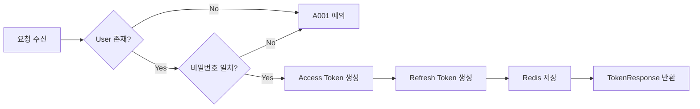
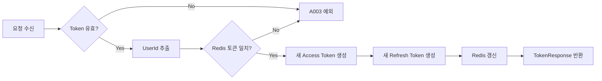
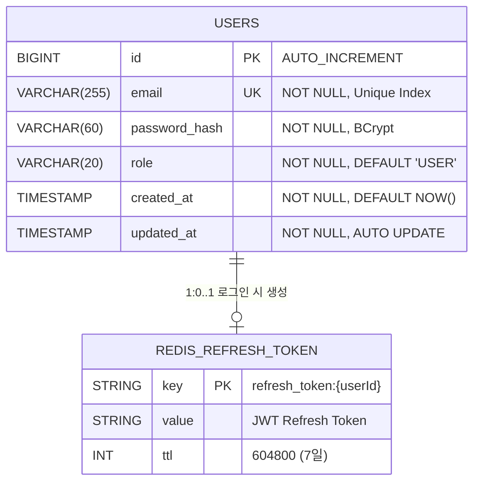
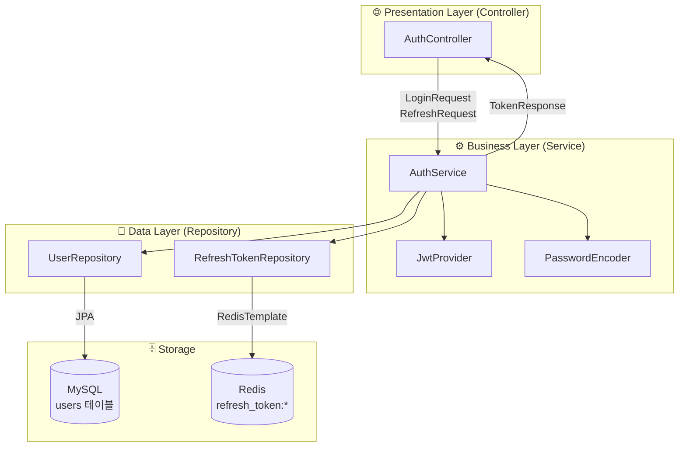
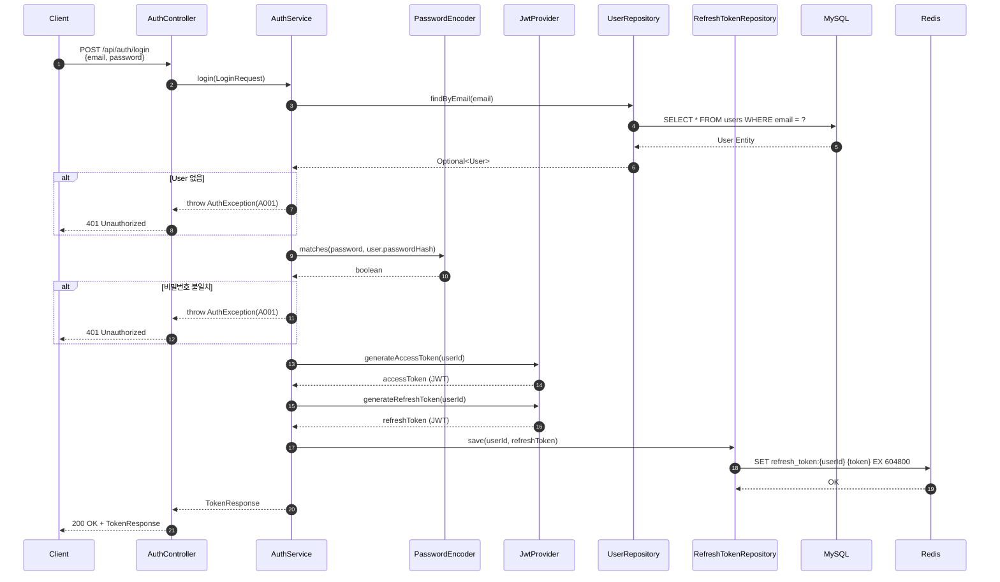
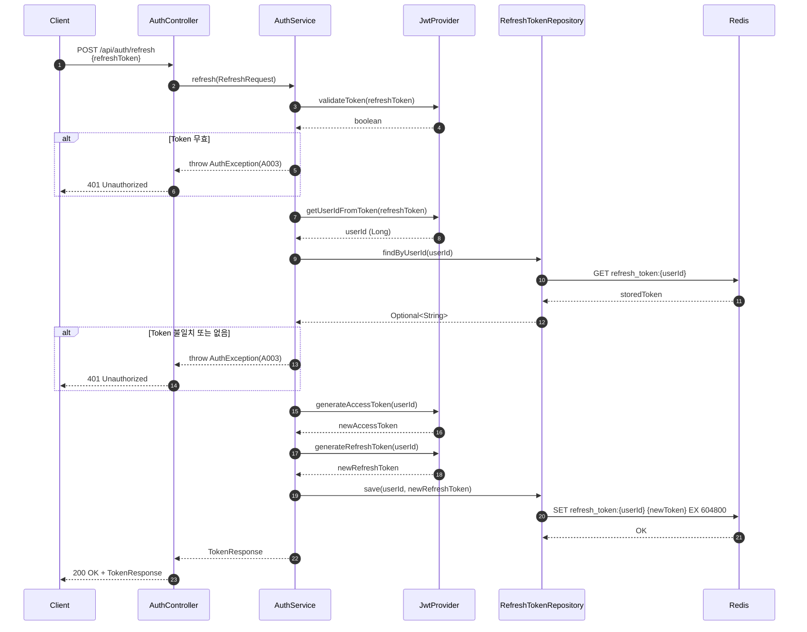
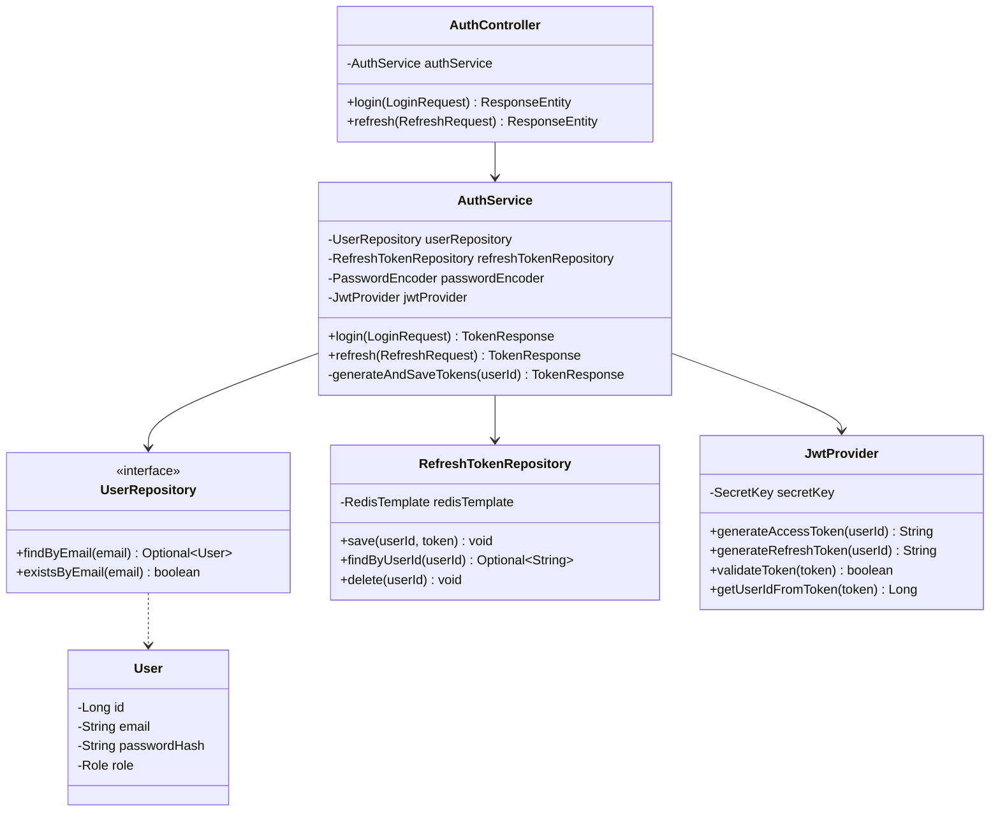

# [BE-004] 로그인 및 토큰 갱신(Refresh)

**Epic:** EPIC_AUTH  
**Priority:** Must  
**Effort:** M  
**Start Date:** 2026-02-03  
**Due Date:** 2026-02-04  
**Dependencies:** BE-003 ✅ 완료

> ⚠️ **상태**: BE-003 (PR #14)에서 구현 완료. 본 이슈는 테스트 코드 작성 및 검증으로 범위 조정.

---

## 목적 및 요약
- **목적**: 기존 사용자의 재진입을 처리한다.
- **요약**: `POST /api/auth/login` 처리 및 Refresh Token을 이용한 `POST /api/auth/refresh` 기능 구현.

## 관련 스펙 (SRS)
- **ID**: REQ-FUNC-025
- **Component**: Backend API
- **참조 규칙**: 
  - `.cursor/rules/307-api-design-exception-handling.mdc`
  - `.cursor/rules/308-spring-security-jwt-rules.mdc`

---

## 🌐 Endpoint 명세

### 1. 로그인 API

| 항목 | 값 |
|-----|-----|
| **URI** | `/api/auth/login` |
| **Method** | `POST` |
| **인증** | 불필요 (Public) |
| **Content-Type** | `application/json` |

### 2. 토큰 갱신 API

| 항목 | 값 |
|-----|-----|
| **URI** | `/api/auth/refresh` |
| **Method** | `POST` |
| **인증** | 불필요 (Public) |
| **Content-Type** | `application/json` |

---

## 📥 Request Body 명세

### Login Request

| 필드 | 타입 | 필수 | Validation | 설명 |
|-----|------|-----|------------|------|
| `email` | String | ✅ | `@NotBlank`, `@Email` | 사용자 이메일 (로그인 ID) |
| `password` | String | ✅ | `@NotBlank` | 비밀번호 (평문) |

**요청 예시:**
```json
{
  "email": "user@example.com",
  "password": "securePassword123"
}
```

### Refresh Request

| 필드 | 타입 | 필수 | Validation | 설명 |
|-----|------|-----|------------|------|
| `refreshToken` | String | ✅ | `@NotBlank` | 이전에 발급받은 Refresh Token |

**요청 예시:**
```json
{
  "refreshToken": "eyJhbGciOiJIUzI1NiIsInR5cCI6IkpXVCJ9..."
}
```

---

## 📤 Response Body 명세

### 성공 응답 (200 OK)

표준 응답 포맷 `ApiResponse<TokenResponse>` 사용:

```json
{
  "success": true,
  "data": {
    "accessToken": "eyJhbGciOiJIUzI1NiIsInR5cCI6IkpXVCJ9...",
    "refreshToken": "eyJhbGciOiJIUzI1NiIsInR5cCI6IkpXVCJ9...",
    "expiresIn": 1800
  },
  "error": null
}
```

| 필드 | 타입 | 설명 |
|-----|------|------|
| `accessToken` | String | API 인증용 JWT (만료: 30분) |
| `refreshToken` | String | 토큰 갱신용 JWT (만료: 7일) |
| `expiresIn` | Long | Access Token 만료 시간 (초) |

### 에러 응답

#### 401 Unauthorized - 인증 실패 (A001)
```json
{
  "success": false,
  "data": null,
  "error": {
    "code": "A001",
    "message": "이메일 또는 비밀번호가 일치하지 않습니다"
  }
}
```

#### 401 Unauthorized - 유효하지 않은 Refresh Token (A003)
```json
{
  "success": false,
  "data": null,
  "error": {
    "code": "A003",
    "message": "유효하지 않거나 만료된 토큰입니다"
  }
}
```

#### 400 Bad Request - Validation 실패 (C001)
```json
{
  "success": false,
  "data": null,
  "error": {
    "code": "C001",
    "message": "유효하지 않은 입력값입니다"
  }
}
```

---

## 🔄 Logic Steps

### Login 로직 순서



| 단계 | 처리 | 예외 |
|-----|------|-----|
| 1 | 이메일로 사용자 조회 | 없으면 `A001 INVALID_CREDENTIALS` |
| 2 | BCrypt 비밀번호 검증 | 불일치 시 `A001 INVALID_CREDENTIALS` |
| 3 | Access Token 생성 (30분 만료) | - |
| 4 | Refresh Token 생성 (7일 만료) | - |
| 5 | Refresh Token Redis 저장 (TTL: 7일) | - |
| 6 | TokenResponse 반환 | - |

### Refresh 로직 순서



| 단계 | 처리 | 예외 |
|-----|------|-----|
| 1 | Refresh Token JWT 유효성 검증 (서명, 만료) | 실패 시 `A003 INVALID_REFRESH_TOKEN` |
| 2 | Token에서 UserId 추출 | - |
| 3 | Redis 저장 토큰과 비교 | 불일치/없음 시 `A003 INVALID_REFRESH_TOKEN` |
| 4 | 새 Access Token 생성 (30분 만료) | - |
| 5 | 새 Refresh Token 생성 (7일 만료) | - |
| 6 | Redis Refresh Token 갱신 (TTL: 7일) | - |
| 7 | TokenResponse 반환 | - |

---

## 🗃️ ERD (Entity Relationship Diagram)

> **데이터가 어떻게 저장될 것인가?** (데이터베이스 관점)

### 물리적 데이터 모델



### MySQL 테이블 스키마

```sql
-- V1__create_users_table.sql
CREATE TABLE users (
    -- Primary Key
    id BIGINT AUTO_INCREMENT PRIMARY KEY COMMENT '사용자 고유 ID',
    
    -- 사용자 정보
    email VARCHAR(255) NOT NULL COMMENT '이메일 (로그인 ID)',
    password_hash VARCHAR(60) NOT NULL COMMENT 'BCrypt 해시 비밀번호',
    role VARCHAR(20) NOT NULL DEFAULT 'USER' COMMENT '사용자 권한 (USER, ADMIN)',
    
    -- Auditing 필드
    created_at TIMESTAMP NOT NULL DEFAULT CURRENT_TIMESTAMP COMMENT '생성일시',
    updated_at TIMESTAMP NOT NULL DEFAULT CURRENT_TIMESTAMP ON UPDATE CURRENT_TIMESTAMP COMMENT '수정일시',
    
    -- Unique Constraint
    CONSTRAINT uk_users_email UNIQUE (email)
    
) ENGINE=InnoDB 
  DEFAULT CHARSET=utf8mb4 
  COLLATE=utf8mb4_unicode_ci 
  COMMENT='사용자 테이블';
```

### Redis Key-Value 구조

| Key 패턴 | Value | TTL | 설명 |
|---------|-------|-----|------|
| `refresh_token:{userId}` | JWT Refresh Token 문자열 | 604800초 (7일) | 사용자별 Refresh Token 저장 |

**예시:**
```
KEY:   refresh_token:1
VALUE: eyJhbGciOiJIUzI1NiIsInR5cCI6IkpXVCJ9.eyJzdWIiOiIxIiwiaWF0IjoxNzA...
TTL:   604800
```

---

## 🔧 CLD (Class/Component Logic Diagram)

> **데이터가 어떻게 가공될 것인가?** (백엔드 서버 관점)

### 3-Tier Architecture 계층도



### 로그인 데이터 흐름 시퀀스



### 토큰 갱신 데이터 흐름 시퀀스



### 컴포넌트 의존성 다이어그램



---

## 💻 ORM 예제코드 (Object Relational Mapping)

> **서버가 데이터베이스를 조회하는 연결적 관점** (JPA Entity, Repository, Data Access Code)

### 1. JPA Entity: User

```java
package com.wombat.screenlock.unwind_be.domain.user.entity;

/**
 * 사용자 엔티티
 * 
 * <p>회원 정보 및 인증 정보를 저장합니다.</p>
 * 
 * <h3>테이블 매핑</h3>
 * <ul>
 *   <li>테이블명: users</li>
 *   <li>PK: id (AUTO_INCREMENT)</li>
 *   <li>UK: email (Unique Index)</li>
 * </ul>
 */
@Entity
@Table(name = "users", indexes = {
    @Index(name = "uk_users_email", columnList = "email", unique = true)
})
@Getter
@NoArgsConstructor(access = AccessLevel.PROTECTED)
public class User extends BaseTimeEntity {

    @Id
    @GeneratedValue(strategy = GenerationType.IDENTITY)
    private Long id;

    @Column(nullable = false, unique = true, length = 255)
    private String email;

    @Column(name = "password_hash", nullable = false, length = 60)
    private String passwordHash;

    @Enumerated(EnumType.STRING)
    @Column(nullable = false, length = 20)
    private Role role;

    @Builder
    public User(String email, String passwordHash, Role role) {
        this.email = email;
        this.passwordHash = passwordHash;
        this.role = (role != null) ? role : Role.USER;
    }
}
```

### 2. JPA Repository: UserRepository

```java
package com.wombat.screenlock.unwind_be.domain.user.repository;

/**
 * User 엔티티 Repository
 * 
 * <p>JPA 기반 데이터 접근 계층으로, Spring Data JPA Query Method를 활용합니다.</p>
 */
@Repository
public interface UserRepository extends JpaRepository<User, Long> {

    /**
     * 이메일로 사용자 조회 (로그인용)
     * 
     * <p>생성되는 SQL:</p>
     * <pre>
     * SELECT * FROM users WHERE email = ?
     * </pre>
     * 
     * @param email 조회할 이메일
     * @return 사용자 Optional (존재하지 않으면 empty)
     */
    Optional<User> findByEmail(String email);

    /**
     * 이메일 존재 여부 확인 (회원가입 중복 체크용)
     * 
     * <p>생성되는 SQL:</p>
     * <pre>
     * SELECT COUNT(*) > 0 FROM users WHERE email = ?
     * </pre>
     * 
     * @param email 확인할 이메일
     * @return 존재 여부
     */
    boolean existsByEmail(String email);
}
```

### 3. Redis Repository: RefreshTokenRepository

```java
package com.wombat.screenlock.unwind_be.infrastructure.redis;

/**
 * RefreshToken Redis Repository
 * 
 * <p>JWT Refresh Token의 저장, 조회, 삭제를 담당합니다.</p>
 * 
 * <h3>Redis 저장 구조</h3>
 * <ul>
 *   <li>Key: refresh_token:{userId}</li>
 *   <li>Value: JWT Refresh Token 문자열</li>
 *   <li>TTL: 7일 (604800초)</li>
 * </ul>
 */
@Repository
@RequiredArgsConstructor
@Slf4j
public class RefreshTokenRepository {

    private static final String KEY_PREFIX = "refresh_token:";
    private static final long TTL_SECONDS = 604800L; // 7일

    private final RedisTemplate<String, String> redisTemplate;

    /**
     * RefreshToken 저장
     * 
     * <p>Redis 명령어: SET refresh_token:{userId} {token} EX 604800</p>
     */
    public void save(Long userId, String token) {
        String key = KEY_PREFIX + userId;
        redisTemplate.opsForValue().set(key, token, TTL_SECONDS, TimeUnit.SECONDS);
        log.debug("RefreshToken 저장 완료: userId={}", userId);
    }

    /**
     * RefreshToken 조회
     * 
     * <p>Redis 명령어: GET refresh_token:{userId}</p>
     */
    public Optional<String> findByUserId(Long userId) {
        String key = KEY_PREFIX + userId;
        String token = redisTemplate.opsForValue().get(key);
        return Optional.ofNullable(token);
    }

    /**
     * RefreshToken 삭제 (로그아웃용)
     * 
     * <p>Redis 명령어: DEL refresh_token:{userId}</p>
     */
    public void delete(Long userId) {
        String key = KEY_PREFIX + userId;
        redisTemplate.delete(key);
        log.debug("RefreshToken 삭제 완료: userId={}", userId);
    }
}
```

### 4. Service Layer: AuthService (Data Access 부분)

```java
package com.wombat.screenlock.unwind_be.application.auth;

/**
 * 인증 서비스 - 데이터 접근 패턴
 */
@Service
@RequiredArgsConstructor
@Transactional(readOnly = true)
@Slf4j
public class AuthService {

    private final UserRepository userRepository;
    private final RefreshTokenRepository refreshTokenRepository;
    private final PasswordEncoder passwordEncoder;
    private final JwtProvider jwtProvider;

    /**
     * 로그인 - MySQL + Redis 연동
     * 
     * <h3>데이터 접근 순서</h3>
     * <ol>
     *   <li>MySQL: SELECT user WHERE email = ?</li>
     *   <li>Memory: BCrypt 비밀번호 검증</li>
     *   <li>Memory: JWT Access/Refresh Token 생성</li>
     *   <li>Redis: SET refresh_token:{userId}</li>
     * </ol>
     */
    @Transactional
    public TokenResponse login(LoginRequest request) {
        // 1. MySQL 조회: email로 User 찾기
        User user = userRepository.findByEmail(request.email())
                .orElseThrow(() -> new AuthException(ErrorCode.INVALID_CREDENTIALS));

        // 2. BCrypt 비밀번호 검증 (메모리 연산)
        if (!passwordEncoder.matches(request.password(), user.getPasswordHash())) {
            throw new AuthException(ErrorCode.INVALID_CREDENTIALS);
        }

        log.info("로그인 성공: userId={}, email={}", user.getId(), user.getEmail());

        // 3-4. Token 발급 및 Redis 저장
        return generateAndSaveTokens(user.getId());
    }

    /**
     * 토큰 갱신 - Redis 연동
     * 
     * <h3>데이터 접근 순서</h3>
     * <ol>
     *   <li>Memory: JWT Refresh Token 검증</li>
     *   <li>Memory: Token에서 UserId 추출</li>
     *   <li>Redis: GET refresh_token:{userId}</li>
     *   <li>Memory: 저장된 토큰과 비교</li>
     *   <li>Memory: 새 Access/Refresh Token 생성</li>
     *   <li>Redis: SET refresh_token:{userId} (갱신)</li>
     * </ol>
     */
    @Transactional
    public TokenResponse refresh(RefreshRequest request) {
        // 1. JWT 유효성 검증 (메모리 연산)
        if (!jwtProvider.validateToken(request.refreshToken())) {
            throw new AuthException(ErrorCode.INVALID_REFRESH_TOKEN);
        }

        // 2. Token에서 UserId 추출 (메모리 연산)
        Long userId = jwtProvider.getUserIdFromToken(request.refreshToken());

        // 3. Redis 조회: 저장된 토큰 가져오기
        String storedToken = refreshTokenRepository.findByUserId(userId)
                .orElseThrow(() -> new AuthException(ErrorCode.INVALID_REFRESH_TOKEN));

        // 4. 저장된 토큰과 비교 (메모리 연산)
        if (!storedToken.equals(request.refreshToken())) {
            throw new AuthException(ErrorCode.INVALID_REFRESH_TOKEN);
        }

        log.info("토큰 갱신: userId={}", userId);

        // 5-6. 새 Token 발급 및 Redis 갱신
        return generateAndSaveTokens(userId);
    }

    /**
     * Token 생성 및 Redis 저장 (Private Helper)
     * 
     * <h3>데이터 접근</h3>
     * <ul>
     *   <li>Memory: JWT 토큰 2개 생성</li>
     *   <li>Redis: Refresh Token 저장 (TTL: 7일)</li>
     * </ul>
     */
    private TokenResponse generateAndSaveTokens(Long userId) {
        // Memory: JWT 생성
        String accessToken = jwtProvider.generateAccessToken(userId);
        String refreshToken = jwtProvider.generateRefreshToken(userId);

        // Redis: Refresh Token 저장
        refreshTokenRepository.save(userId, refreshToken);

        return new TokenResponse(
                accessToken,
                refreshToken,
                jwtProvider.getAccessTokenExpirationSeconds()
        );
    }
}
```

### 5. 데이터 접근 요약 테이블

| 작업 | 저장소 | 연산 | 명령어/쿼리 |
|-----|-------|------|-----------|
| 사용자 조회 | MySQL | READ | `SELECT * FROM users WHERE email = ?` |
| 비밀번호 검증 | Memory | COMPUTE | `BCrypt.matches(plain, hash)` |
| Access Token 생성 | Memory | COMPUTE | `Jwts.builder().subject(userId).signWith(key).compact()` |
| Refresh Token 생성 | Memory | COMPUTE | `Jwts.builder().subject(userId).signWith(key).compact()` |
| Refresh Token 저장 | Redis | WRITE | `SET refresh_token:{userId} {token} EX 604800` |
| Refresh Token 조회 | Redis | READ | `GET refresh_token:{userId}` |
| Refresh Token 삭제 | Redis | DELETE | `DEL refresh_token:{userId}` |
| JWT 검증 | Memory | COMPUTE | `Jwts.parser().verifyWith(key).parseSignedClaims(token)` |

---

## 📊 Difficulty (난이도 분석)

| 컴포넌트 | 난이도 | 예상 시간 | 비고 |
|----------|-------|----------|-----|
| Login 로직 | 중 | 1h | BCrypt 검증, 토큰 발급 |
| Refresh 로직 | 중 | 1h | Redis 비교, 토큰 갱신 |
| Unit Test | 중 | 2h | AuthService 모킹 테스트 |
| Integration Test | 상 | 2h | MockMvc + Redis 연동 |
| **총합** | **M** | **~6h** | |

---

## ✅ Definition of Done (DoD)

### 기능 구현 (BE-003에서 완료)
- [x] **Login**: 유효한 이메일/비번으로 로그인 시 토큰이 발급되어야 한다.
- [x] **Refresh**: 유효한 RefreshToken으로 새 AccessToken을 받아야 한다.
- [x] **Error**: 잘못된 인증 정보 시 401 에러가 반환되어야 한다.
- [x] **Storage**: RefreshToken이 Redis에 저장되어야 한다.

### 테스트 (미완료 - 본 이슈 범위)
- [ ] **Unit Test**: `AuthServiceTest` 작성
  - [ ] `login()` 성공 케이스
  - [ ] `login()` 사용자 없음 예외
  - [ ] `login()` 비밀번호 불일치 예외
  - [ ] `refresh()` 성공 케이스
  - [ ] `refresh()` 토큰 무효 예외
  - [ ] `refresh()` Redis 불일치 예외
- [ ] **Integration Test**: `AuthIntegrationTest` 작성
  - [ ] 로그인 API 통합 테스트
  - [ ] 토큰 갱신 API 통합 테스트
  - [ ] 잘못된 인증 정보 401 응답 테스트

---

## 🛠️ 기술 스택

| 기술 | 버전 | 용도 |
|-----|------|------|
| Spring Security | 6.x | 인증/인가 |
| JWT (jjwt) | 0.12.3 | 토큰 생성/검증 |
| BCrypt | - | 비밀번호 해싱 |
| Spring Data Redis | - | Refresh Token 저장 |
| jakarta.validation | - | 요청 DTO 검증 |

---

## 🧪 테스트 명세

### Unit Test: AuthServiceTest

```java
@DisplayName("AuthService 테스트")
@ExtendWith(MockitoExtension.class)
class AuthServiceTest {
    
    @Mock UserRepository userRepository;
    @Mock RefreshTokenRepository refreshTokenRepository;
    @Mock PasswordEncoder passwordEncoder;
    @Mock JwtProvider jwtProvider;
    @InjectMocks AuthService authService;
    
    @Nested
    @DisplayName("로그인")
    class Login {
        @Test
        @DisplayName("유효한 인증 정보로 로그인 시 토큰 반환")
        void should_ReturnToken_When_ValidCredentials() { }
        
        @Test
        @DisplayName("존재하지 않는 이메일로 로그인 시 A001 예외")
        void should_ThrowA001_When_UserNotFound() { }
        
        @Test
        @DisplayName("비밀번호 불일치 시 A001 예외")
        void should_ThrowA001_When_PasswordMismatch() { }
    }
    
    @Nested
    @DisplayName("토큰 갱신")
    class Refresh {
        @Test
        @DisplayName("유효한 Refresh Token으로 새 토큰 반환")
        void should_ReturnNewToken_When_ValidRefreshToken() { }
        
        @Test
        @DisplayName("유효하지 않은 토큰으로 갱신 시 A003 예외")
        void should_ThrowA003_When_TokenInvalid() { }
        
        @Test
        @DisplayName("Redis에 없는 토큰으로 갱신 시 A003 예외")
        void should_ThrowA003_When_TokenNotInRedis() { }
    }
}
```

### Integration Test: AuthIntegrationTest

```java
@SpringBootTest
@AutoConfigureMockMvc
@DisplayName("인증 API 통합 테스트")
class AuthIntegrationTest {
    
    @Autowired MockMvc mockMvc;
    @Autowired ObjectMapper objectMapper;
    
    @Test
    @DisplayName("POST /api/auth/login - 성공")
    void should_LoginAndReturnToken() throws Exception {
        // given
        LoginRequest request = new LoginRequest("test@example.com", "password123");
        
        // when & then
        mockMvc.perform(post("/api/auth/login")
                .contentType(MediaType.APPLICATION_JSON)
                .content(objectMapper.writeValueAsString(request)))
                .andExpect(status().isOk())
                .andExpect(jsonPath("$.success").value(true))
                .andExpect(jsonPath("$.data.accessToken").exists())
                .andExpect(jsonPath("$.data.refreshToken").exists());
    }
    
    @Test
    @DisplayName("POST /api/auth/login - 잘못된 인증 정보 시 401")
    void should_Return401_When_InvalidCredentials() throws Exception {
        // given
        LoginRequest request = new LoginRequest("wrong@example.com", "wrongpassword");
        
        // when & then
        mockMvc.perform(post("/api/auth/login")
                .contentType(MediaType.APPLICATION_JSON)
                .content(objectMapper.writeValueAsString(request)))
                .andExpect(status().isUnauthorized())
                .andExpect(jsonPath("$.success").value(false))
                .andExpect(jsonPath("$.error.code").value("A001"));
    }
    
    @Test
    @DisplayName("POST /api/auth/refresh - 성공")
    void should_RefreshToken() throws Exception {
        // given - 먼저 로그인하여 토큰 획득
        // ...
        
        // when & then
        mockMvc.perform(post("/api/auth/refresh")
                .contentType(MediaType.APPLICATION_JSON)
                .content(objectMapper.writeValueAsString(refreshRequest)))
                .andExpect(status().isOk())
                .andExpect(jsonPath("$.success").value(true))
                .andExpect(jsonPath("$.data.accessToken").exists());
    }
}
```

---

## 📁 관련 파일

### 구현 완료 (BE-003)
- `src/main/java/com/.../api/auth/controller/AuthController.java`
- `src/main/java/com/.../api/auth/dto/LoginRequest.java`
- `src/main/java/com/.../api/auth/dto/RefreshRequest.java`
- `src/main/java/com/.../api/auth/dto/TokenResponse.java`
- `src/main/java/com/.../application/auth/AuthService.java`
- `src/main/java/com/.../infrastructure/jwt/JwtProvider.java`
- `src/main/java/com/.../infrastructure/redis/RefreshTokenRepository.java`

### 테스트 작성 필요
- `src/test/java/com/.../application/auth/AuthServiceTest.java` (신규)
- `src/test/java/com/.../api/auth/AuthIntegrationTest.java` (신규)

---

**Labels:** `backend`, `must`, `phase-1`  
**Milestone:** v1.0-MVP
