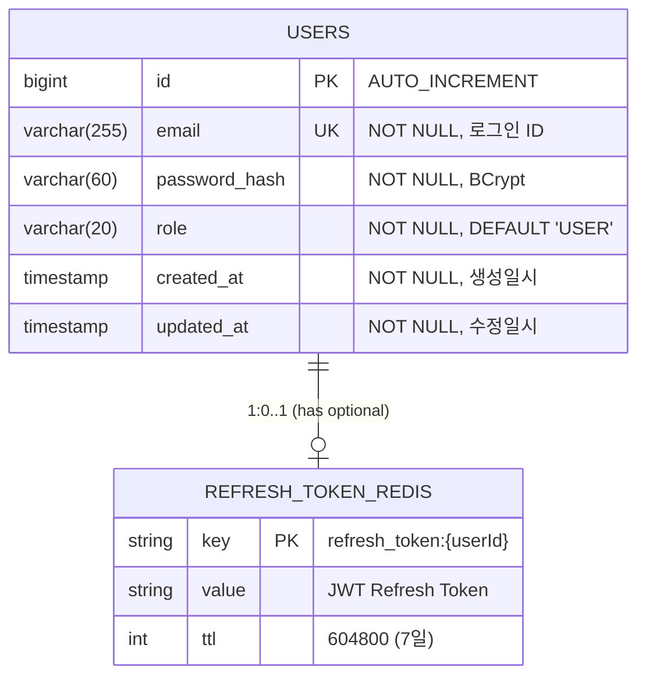
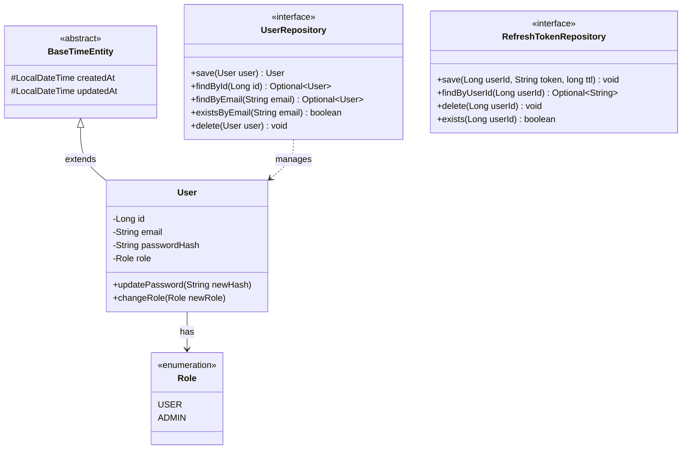
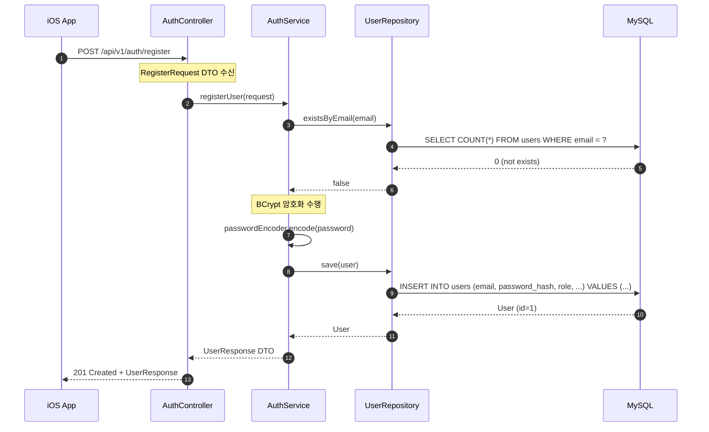

# [BE-001] User Entity 데이터 모델링

**Epic:** EPIC_AUTH  
**Priority:** Must  
**Effort:** S (Small)  
**Difficulty:** 하  
**Start Date:** 2026-01-30  
**Due Date:** 2026-01-30  
**Dependencies:** None (Backend 시작 작업)

---

## 목적 및 요약
- **목적**: 사용자 및 인증 정보를 저장하기 위한 DB 구조를 정의한다.
- **요약**: `User` 엔티티와 `RefreshToken` 저장소(Redis)를 설계한다.

## 관련 스펙 (SRS)
- **ID**: REQ-FUNC-024 (Data Layer)
- **Component**: Backend DB

---

## 아키텍처 개요

### 3-Tier Layered Architecture

```
┌─────────────────────────────────────────────────────────────┐
│                    Client (iOS App)                         │
└─────────────────────────────────────────────────────────────┘
                              │
                              ▼
┌─────────────────────────────────────────────────────────────┐
│  Controller Layer (API Interface)                           │
│  ┌─────────────────────────────────────────────────────┐    │
│  │  AuthController                                      │    │
│  │  - POST /api/v1/auth/register                       │    │
│  │  - POST /api/v1/auth/login                          │    │
│  │  - POST /api/v1/auth/refresh                        │    │
│  └─────────────────────────────────────────────────────┘    │
│  DTO: RegisterRequest, LoginRequest, AuthResponse           │
└─────────────────────────────────────────────────────────────┘
                              │
                              ▼
┌─────────────────────────────────────────────────────────────┐
│  Service Layer (Business Logic)                             │
│  ┌─────────────────────────────────────────────────────┐    │
│  │  AuthService                                         │    │
│  │  - registerUser(RegisterRequest)                    │    │
│  │  - login(LoginRequest)                              │    │
│  │  - refreshToken(String refreshToken)                │    │
│  └─────────────────────────────────────────────────────┘    │
│  Processes: Validation → Password Encrypt → Save → Token   │
└─────────────────────────────────────────────────────────────┘
                              │
                              ▼
┌─────────────────────────────────────────────────────────────┐
│  Repository Layer (Data Access)                 ◀── BE-001  │
│  ┌─────────────────────────────────────────────────────┐    │
│  │  UserRepository (JPA)                               │    │
│  │  - save(User)                                       │    │
│  │  - findByEmail(String)                              │    │
│  │  - existsByEmail(String)                            │    │
│  └─────────────────────────────────────────────────────┘    │
│  ┌─────────────────────────────────────────────────────┐    │
│  │  RefreshTokenRepository (Redis)                     │    │
│  │  - save(userId, token, TTL)                         │    │
│  │  - findByUserId(Long)                               │    │
│  │  - delete(userId)                                   │    │
│  └─────────────────────────────────────────────────────┘    │
└─────────────────────────────────────────────────────────────┘
                              │
                              ▼
┌─────────────────────────────────────────────────────────────┐
│  Database Layer                                             │
│  ┌────────────────────┐    ┌────────────────────┐           │
│  │  MySQL 8.0         │    │  Redis             │           │
│  │  - users table     │    │  - refresh_token:* │           │
│  └────────────────────┘    └────────────────────┘           │
└─────────────────────────────────────────────────────────────┘
```

---

## ERD (Entity Relationship Diagram)

> 데이터가 어떻게 저장될 것인가? (데이터베이스 관점)

### Mermaid ERD



### 테이블 상세 스펙

#### users 테이블

| 필드명 | 타입 | 필수 | 기본값 | 제약조건 | 설명 |
|--------|------|------|--------|----------|------|
| id | BIGINT | Y | AUTO_INCREMENT | PK | 사용자 고유 ID |
| email | VARCHAR(255) | Y | - | UNIQUE, NOT NULL | 이메일 (로그인 ID) |
| password_hash | VARCHAR(60) | Y | - | NOT NULL | BCrypt 해시 비밀번호 |
| role | VARCHAR(20) | Y | 'USER' | NOT NULL | 사용자 권한 (USER, ADMIN) |
| created_at | TIMESTAMP | Y | CURRENT_TIMESTAMP | NOT NULL | 생성일시 |
| updated_at | TIMESTAMP | Y | CURRENT_TIMESTAMP ON UPDATE | NOT NULL | 수정일시 |

#### 인덱스

| 인덱스명 | 타입 | 컬럼 | 설명 |
|----------|------|------|------|
| PRIMARY | PK | id | 기본키 |
| uk_users_email | UNIQUE | email | 이메일 중복 방지 |

#### RefreshToken (Redis)

| Key Pattern | Value | TTL | 설명 |
|-------------|-------|-----|------|
| `refresh_token:{userId}` | JWT Refresh Token | 7일 (604800초) | 사용자별 리프레시 토큰 |

---

## CLD (Class/Component Logic Diagram)

> 데이터가 어떻게 가공될 것인가? (백엔드 서버 관점)

### Mermaid Class Diagram



### 데이터 흐름 시퀀스 (회원가입 예시)



---

## ORM 예제코드 (Object Relational Mapping)

> 서버가 데이터베이스를 조회하는 연결적 관점

### 1. 패키지 구조

```
src/main/java/com/wombat/screenlock/unwind_be/
├── config/
│   └── JpaAuditingConfig.java          # JPA Auditing 설정
├── domain/
│   ├── common/
│   │   └── BaseTimeEntity.java         # 공통 시간 엔티티
│   └── user/
│       ├── entity/
│       │   ├── User.java               # User 엔티티
│       │   └── Role.java               # Role Enum
│       └── repository/
│           └── UserRepository.java     # User Repository
└── infrastructure/
    └── redis/
        └── RefreshTokenRepository.java # Redis Repository
```

### 2. JPA Auditing 설정

```java
package com.wombat.screenlock.unwind_be.config;

import org.springframework.context.annotation.Configuration;
import org.springframework.data.jpa.repository.config.EnableJpaAuditing;

/**
 * JPA Auditing 활성화 설정
 * - @CreatedDate, @LastModifiedDate 자동 주입 활성화
 */
@Configuration
@EnableJpaAuditing
public class JpaAuditingConfig {
}
```

### 3. BaseTimeEntity (공통 시간 엔티티)

```java
package com.wombat.screenlock.unwind_be.domain.common;

import jakarta.persistence.Column;
import jakarta.persistence.EntityListeners;
import jakarta.persistence.MappedSuperclass;
import lombok.Getter;
import org.springframework.data.annotation.CreatedDate;
import org.springframework.data.annotation.LastModifiedDate;
import org.springframework.data.jpa.domain.support.AuditingEntityListener;

import java.time.LocalDateTime;

/**
 * 공통 시간 필드 추상 클래스
 * - 모든 엔티티가 상속하여 createdAt, updatedAt 자동 관리
 */
@MappedSuperclass
@EntityListeners(AuditingEntityListener.class)
@Getter
public abstract class BaseTimeEntity {

    /**
     * 생성 일시 (INSERT 시 자동 설정, 수정 불가)
     */
    @CreatedDate
    @Column(updatable = false, nullable = false)
    private LocalDateTime createdAt;

    /**
     * 수정 일시 (UPDATE 시 자동 갱신)
     */
    @LastModifiedDate
    @Column(nullable = false)
    private LocalDateTime updatedAt;
}
```

### 4. Role Enum

```java
package com.wombat.screenlock.unwind_be.domain.user.entity;

/**
 * 사용자 권한 Enum
 * - USER: 일반 사용자
 * - ADMIN: 관리자
 */
public enum Role {
    USER,
    ADMIN
}
```

### 5. User Entity

```java
package com.wombat.screenlock.unwind_be.domain.user.entity;

import com.wombat.screenlock.unwind_be.domain.common.BaseTimeEntity;
import jakarta.persistence.*;
import lombok.AccessLevel;
import lombok.Builder;
import lombok.Getter;
import lombok.NoArgsConstructor;

/**
 * 사용자 엔티티
 * - 회원 정보 및 인증 정보 저장
 * - email을 통한 로그인 식별
 */
@Entity
@Table(name = "users", indexes = {
    @Index(name = "uk_users_email", columnList = "email", unique = true)
})
@Getter
@NoArgsConstructor(access = AccessLevel.PROTECTED)
public class User extends BaseTimeEntity {

    @Id
    @GeneratedValue(strategy = GenerationType.IDENTITY)
    private Long id;

    /**
     * 이메일 (로그인 ID, Unique)
     */
    @Column(nullable = false, unique = true, length = 255)
    private String email;

    /**
     * BCrypt 해시 비밀번호 (60자 고정)
     */
    @Column(name = "password_hash", nullable = false, length = 60)
    private String passwordHash;

    /**
     * 사용자 권한 (USER, ADMIN)
     */
    @Enumerated(EnumType.STRING)
    @Column(nullable = false, length = 20)
    private Role role;

    /**
     * 생성자 (Builder 패턴 사용 권장)
     */
    @Builder
    public User(String email, String passwordHash, Role role) {
        this.email = email;
        this.passwordHash = passwordHash;
        this.role = (role != null) ? role : Role.USER;
    }

    // ========== 비즈니스 메서드 ==========

    /**
     * 비밀번호 변경
     * @param newPasswordHash 새로운 BCrypt 해시 비밀번호
     */
    public void updatePassword(String newPasswordHash) {
        this.passwordHash = newPasswordHash;
    }

    /**
     * 권한 변경
     * @param newRole 새로운 권한
     */
    public void changeRole(Role newRole) {
        this.role = newRole;
    }
}
```

### 6. UserRepository (Data Access)

```java
package com.wombat.screenlock.unwind_be.domain.user.repository;

import com.wombat.screenlock.unwind_be.domain.user.entity.User;
import org.springframework.data.jpa.repository.JpaRepository;
import org.springframework.stereotype.Repository;

import java.util.Optional;

/**
 * User 엔티티 Repository
 * - JPA 기반 데이터 접근 계층
 * - Spring Data JPA Query Method 활용
 */
@Repository
public interface UserRepository extends JpaRepository<User, Long> {

    /**
     * 이메일로 사용자 조회
     * @param email 이메일
     * @return Optional<User>
     */
    Optional<User> findByEmail(String email);

    /**
     * 이메일 존재 여부 확인
     * @param email 이메일
     * @return 존재 여부
     */
    boolean existsByEmail(String email);
}
```

### 7. RefreshTokenRepository (Redis)

```java
package com.wombat.screenlock.unwind_be.infrastructure.redis;

import lombok.RequiredArgsConstructor;
import org.springframework.data.redis.core.RedisTemplate;
import org.springframework.stereotype.Repository;

import java.util.Optional;
import java.util.concurrent.TimeUnit;

/**
 * RefreshToken Redis Repository
 * - JWT Refresh Token 저장/조회/삭제
 * - TTL: 7일 (604800초)
 */
@Repository
@RequiredArgsConstructor
public class RefreshTokenRepository {

    private static final String KEY_PREFIX = "refresh_token:";
    private static final long TTL_SECONDS = 604800L; // 7일

    private final RedisTemplate<String, String> redisTemplate;

    /**
     * RefreshToken 저장
     * @param userId 사용자 ID
     * @param token JWT Refresh Token
     */
    public void save(Long userId, String token) {
        String key = KEY_PREFIX + userId;
        redisTemplate.opsForValue().set(key, token, TTL_SECONDS, TimeUnit.SECONDS);
    }

    /**
     * RefreshToken 조회
     * @param userId 사용자 ID
     * @return Optional<String> RefreshToken
     */
    public Optional<String> findByUserId(Long userId) {
        String key = KEY_PREFIX + userId;
        String token = redisTemplate.opsForValue().get(key);
        return Optional.ofNullable(token);
    }

    /**
     * RefreshToken 삭제 (로그아웃 시)
     * @param userId 사용자 ID
     */
    public void delete(Long userId) {
        String key = KEY_PREFIX + userId;
        redisTemplate.delete(key);
    }

    /**
     * RefreshToken 존재 여부 확인
     * @param userId 사용자 ID
     * @return 존재 여부
     */
    public boolean exists(Long userId) {
        String key = KEY_PREFIX + userId;
        return Boolean.TRUE.equals(redisTemplate.hasKey(key));
    }
}
```

### 8. DDL (Flyway Migration)

```sql
-- V1__create_users_table.sql
-- User 테이블 생성

CREATE TABLE users (
    id BIGINT AUTO_INCREMENT PRIMARY KEY COMMENT '사용자 고유 ID',
    email VARCHAR(255) NOT NULL COMMENT '이메일 (로그인 ID)',
    password_hash VARCHAR(60) NOT NULL COMMENT 'BCrypt 해시 비밀번호',
    role VARCHAR(20) NOT NULL DEFAULT 'USER' COMMENT '사용자 권한 (USER, ADMIN)',
    created_at TIMESTAMP NOT NULL DEFAULT CURRENT_TIMESTAMP COMMENT '생성일시',
    updated_at TIMESTAMP NOT NULL DEFAULT CURRENT_TIMESTAMP ON UPDATE CURRENT_TIMESTAMP COMMENT '수정일시',
    
    -- Unique Index
    CONSTRAINT uk_users_email UNIQUE (email)
) ENGINE=InnoDB DEFAULT CHARSET=utf8mb4 COLLATE=utf8mb4_unicode_ci COMMENT='사용자 테이블';

-- 인덱스 확인용 (자동 생성됨)
-- CREATE UNIQUE INDEX uk_users_email ON users(email);
```

---

## Logic Steps (구현 순서)

### Phase 1: 환경 설정

1. **DB 환경 설정**
   - MySQL 8.0 연결 설정 (`application.yml`)
   - Flyway 의존성 및 설정 추가 (`build.gradle`)
   - Redis 연결 설정 (`application.yml`)

### Phase 2: Repository Layer (Data Access)

2. **BaseTimeEntity 구현**
   - `@MappedSuperclass` 추상 클래스 생성
   - `@EntityListeners(AuditingEntityListener.class)` 적용
   - `createdAt`, `updatedAt` 필드 정의

3. **JPA Auditing 활성화**
   - `JpaAuditingConfig` 설정 클래스 생성
   - `@EnableJpaAuditing` 적용

4. **Role Enum 정의**
   - `USER`, `ADMIN` 권한 정의

5. **User Entity 정의**
   - `@Entity`, `@Table(name = "users")` 적용
   - 필드 정의 및 `BaseTimeEntity` 상속
   - `@Enumerated(EnumType.STRING)` for role
   - 비즈니스 메서드 구현

6. **Flyway 마이그레이션 스크립트 작성**
   - `V1__create_users_table.sql` 생성
   - DDL 및 인덱스 정의

7. **UserRepository 인터페이스 생성**
   - `JpaRepository<User, Long>` 상속
   - `findByEmail(String email)` 메서드 추가
   - `existsByEmail(String email)` 메서드 추가

8. **RefreshTokenRepository 구현**
   - Redis 기반 토큰 저장소
   - save, find, delete, exists 메서드 구현

### Phase 3: 테스트

9. **테스트 작성 및 검증**
   - Entity Mapping 테스트
   - Repository CRUD 테스트
   - 마이그레이션 실행 확인

---

## Definition of Done (DoD)

### 환경 설정
- [ ] **MySQL 연결**: `application.yml` 데이터베이스 설정 완료
- [ ] **Flyway 설정**: 마이그레이션 자동 실행 설정 완료
- [ ] **Redis 연결**: Redis 연결 설정 완료

### Entity & Repository
- [ ] **BaseTimeEntity**: `@MappedSuperclass` 추상 클래스 구현 완료
- [ ] **JPA Auditing**: `@EnableJpaAuditing` 설정 완료
- [ ] **Role Enum**: `USER`, `ADMIN` 권한 정의 완료
- [ ] **User Entity**:
  - [ ] `id`, `email`, `passwordHash`, `role` 필드 포함
  - [ ] `BaseTimeEntity`(createdAt, updatedAt) 상속
  - [ ] 비즈니스 메서드 (`updatePassword`, `changeRole`) 구현
- [ ] **Migration**: Flyway 스크립트 (`V1__create_users_table.sql`) 작성
- [ ] **UserRepository**: 인터페이스 생성 (`findByEmail`, `existsByEmail` 포함)
- [ ] **RefreshTokenRepository**: Redis 기반 구현 완료

### 테스트
- [ ] **Unit Test**: Entity Mapping 테스트 통과
- [ ] **Integration Test**: Repository CRUD 테스트 통과

---

## 테스트

### Unit Test

```java
@DataJpaTest
class UserRepositoryTest {

    @Autowired
    private UserRepository userRepository;

    @Test
    void 사용자_저장_및_조회_성공() {
        // given
        User user = User.builder()
            .email("test@example.com")
            .passwordHash("$2a$10$...")
            .role(Role.USER)
            .build();

        // when
        User saved = userRepository.save(user);
        Optional<User> found = userRepository.findByEmail("test@example.com");

        // then
        assertThat(saved.getId()).isNotNull();
        assertThat(found).isPresent();
        assertThat(found.get().getEmail()).isEqualTo("test@example.com");
    }

    @Test
    void 이메일_존재여부_확인() {
        // given
        User user = User.builder()
            .email("exists@example.com")
            .passwordHash("$2a$10$...")
            .build();
        userRepository.save(user);

        // when & then
        assertThat(userRepository.existsByEmail("exists@example.com")).isTrue();
        assertThat(userRepository.existsByEmail("notexists@example.com")).isFalse();
    }
}
```

### Integration Test

```java
@SpringBootTest
@Testcontainers
class UserIntegrationTest {

    @Container
    static MySQLContainer<?> mysql = new MySQLContainer<>("mysql:8.0");

    @Autowired
    private UserRepository userRepository;

    @Test
    void Flyway_마이그레이션_실행_확인() {
        // 테이블 존재 확인
        assertThat(userRepository.count()).isGreaterThanOrEqualTo(0);
    }
}
```

---

## 기술 스택

| 구분 | 기술 | 버전 |
|------|------|------|
| Database | MySQL | 8.0 |
| ORM | Spring Data JPA (Hibernate) | 6.x |
| Migration | Flyway | 9.x |
| Cache | Redis (Lettuce) | 7.x |
| Test | JUnit 5 + Testcontainers | 5.x / 1.x |

---

## 파일 생성 체크리스트

| 파일 경로 | 설명 | 상태 |
|-----------|------|------|
| `config/JpaAuditingConfig.java` | JPA Auditing 설정 | [ ] |
| `domain/common/BaseTimeEntity.java` | 공통 시간 엔티티 | [ ] |
| `domain/user/entity/Role.java` | Role Enum | [ ] |
| `domain/user/entity/User.java` | User 엔티티 | [ ] |
| `domain/user/repository/UserRepository.java` | User Repository | [ ] |
| `infrastructure/redis/RefreshTokenRepository.java` | Redis Repository | [ ] |
| `resources/db/migration/V1__create_users_table.sql` | DDL 스크립트 | [ ] |

---

**Labels:** `backend`, `must`, `phase-1`  
**Milestone:** v1.0-MVP
