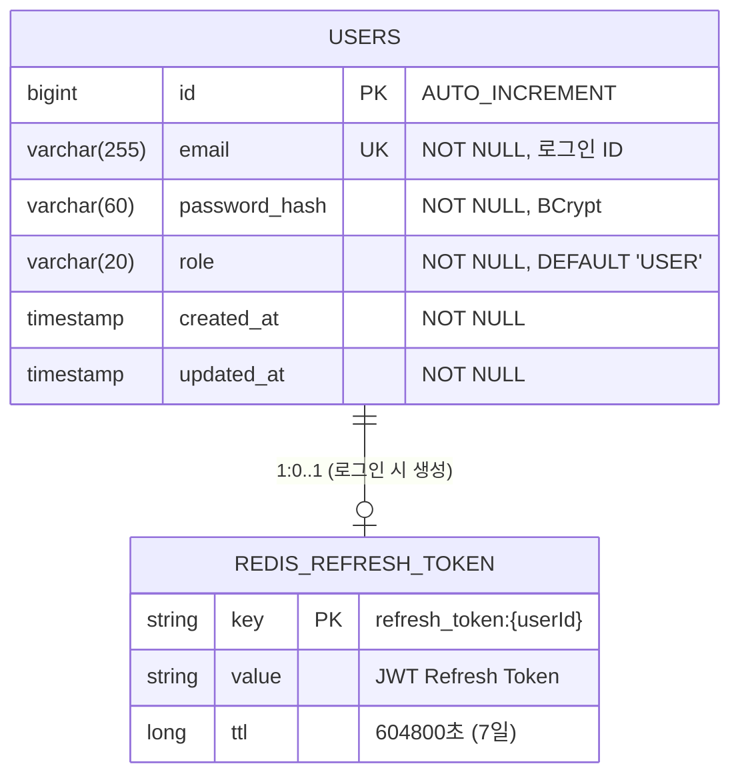
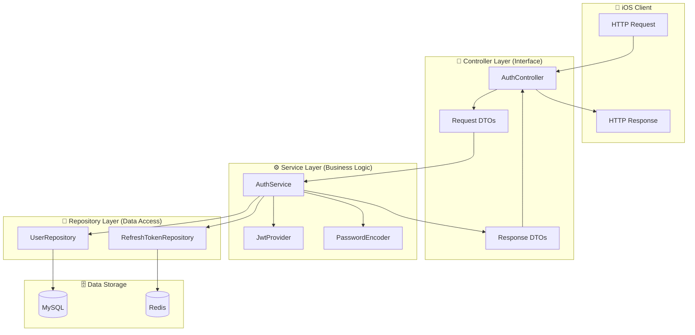
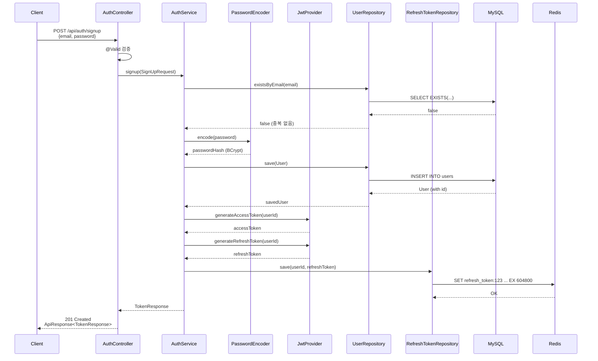
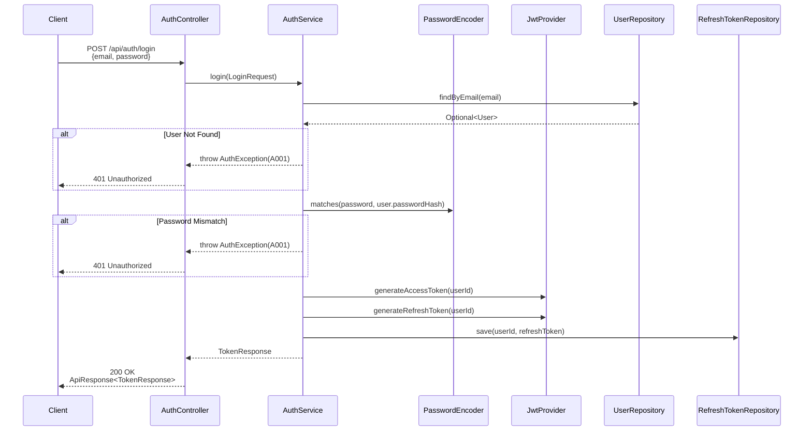
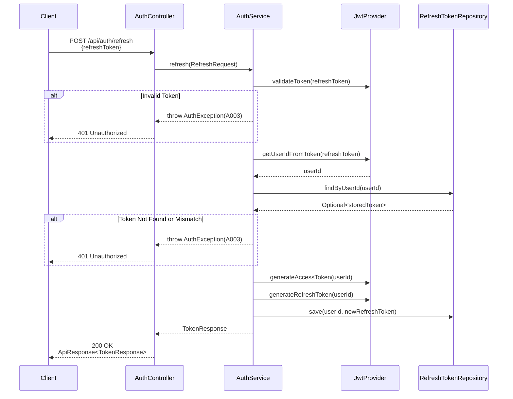

# [BE-002] Auth API 명세 (DTO/Controller)

**Epic:** EPIC_AUTH  
**Priority:** Must  
**Effort:** S  
**Start Date:** 2026-01-31  
**Due Date:** 2026-01-31  
**Dependencies:** BE-001 (User Entity) ✅ 완료

---

## 목적 및 요약
- **목적**: 회원가입, 로그인, 재발급에 필요한 API 스펙을 정의한다.
- **요약**: `AuthController` 스텁 구현 및 DTO(`SignUpRequest`, `LoginRequest`, `RefreshRequest`, `TokenResponse`) 정의.

## 관련 스펙
- **SRS ID**: REQ-FUNC-024, REQ-FUNC-025 (Interface Layer)
- **Component**: Backend API
- **참조 규칙**: 
  - `.cursor/rules/307-api-design-exception-handling.mdc`
  - `.cursor/rules/308-spring-security-jwt-rules.mdc`

---

## 🗂️ ERD (Entity Relationship Diagram)

> **데이터가 어떻게 저장될 것인가?** (데이터베이스 관점)



### 저장소 분리 전략

| 저장소 | 데이터 | 이유 |
|--------|--------|------|
| **MySQL** | User (email, password_hash, role) | 영구 저장, ACID 보장, 관계형 데이터 |
| **Redis** | RefreshToken | 빠른 조회, TTL 자동 만료, Stateless 인증 |

### 테이블 상세

```sql
-- MySQL: users 테이블 (V1__create_users_table.sql로 이미 생성됨)
CREATE TABLE users (
    id BIGINT AUTO_INCREMENT PRIMARY KEY,
    email VARCHAR(255) NOT NULL UNIQUE,
    password_hash VARCHAR(60) NOT NULL,  -- BCrypt 고정 길이
    role VARCHAR(20) NOT NULL DEFAULT 'USER',
    created_at TIMESTAMP NOT NULL DEFAULT CURRENT_TIMESTAMP,
    updated_at TIMESTAMP NOT NULL DEFAULT CURRENT_TIMESTAMP ON UPDATE CURRENT_TIMESTAMP
);

-- Redis: refresh_token:{userId} (Key-Value)
-- Key: "refresh_token:123"
-- Value: "eyJhbGciOiJIUzI1NiIs..."
-- TTL: 604800 (7일)
```

---

## 🔄 CLD (Class/Component Logic Diagram)

> **데이터가 어떻게 가공될 것인가?** (백엔드 서버 관점)

### 3-Tier Architecture 데이터 흐름



### API별 데이터 흐름 상세

#### 1. 회원가입 (POST /api/auth/signup)



#### 2. 로그인 (POST /api/auth/login)



#### 3. 토큰 갱신 (POST /api/auth/refresh)



---

## 💻 ORM 예제 코드 (Object Relational Mapping)

> **서버가 데이터베이스를 조회하는 연결적 관점**

### 1. JPA Entity (이미 구현됨 ✅)

```java
// User.java - domain/user/entity/User.java
@Entity
@Table(name = "users", indexes = {
    @Index(name = "uk_users_email", columnList = "email", unique = true)
})
@Getter
@NoArgsConstructor(access = AccessLevel.PROTECTED)
public class User extends BaseTimeEntity {

    @Id
    @GeneratedValue(strategy = GenerationType.IDENTITY)
    private Long id;

    @Column(nullable = false, unique = true, length = 255)
    private String email;

    @Column(name = "password_hash", nullable = false, length = 60)
    private String passwordHash;

    @Enumerated(EnumType.STRING)
    @Column(nullable = false, length = 20)
    private Role role;

    @Builder
    public User(String email, String passwordHash, Role role) {
        this.email = email;
        this.passwordHash = passwordHash;
        this.role = (role != null) ? role : Role.USER;
    }
}
```

### 2. Repository (이미 구현됨 ✅)

```java
// UserRepository.java - domain/user/repository/UserRepository.java
@Repository
public interface UserRepository extends JpaRepository<User, Long> {
    
    // 로그인 시 사용: 이메일로 사용자 조회
    Optional<User> findByEmail(String email);
    
    // 회원가입 시 사용: 이메일 중복 체크
    boolean existsByEmail(String email);
}

// RefreshTokenRepository.java - infrastructure/redis/RefreshTokenRepository.java
@Repository
@RequiredArgsConstructor
public class RefreshTokenRepository {
    
    private static final String KEY_PREFIX = "refresh_token:";
    private static final long TTL_SECONDS = 604800L; // 7일
    
    private final RedisTemplate<String, String> redisTemplate;
    
    // 토큰 저장 (회원가입/로그인/갱신 시)
    public void save(Long userId, String token) {
        String key = KEY_PREFIX + userId;
        redisTemplate.opsForValue().set(key, token, TTL_SECONDS, TimeUnit.SECONDS);
    }
    
    // 토큰 조회 (갱신 시 검증용)
    public Optional<String> findByUserId(Long userId) {
        String key = KEY_PREFIX + userId;
        return Optional.ofNullable(redisTemplate.opsForValue().get(key));
    }
    
    // 토큰 삭제 (로그아웃 시)
    public void delete(Long userId) {
        redisTemplate.delete(KEY_PREFIX + userId);
    }
}
```

### 3. Data Access 패턴 (Service에서 사용)

```java
// AuthService.java (BE-003에서 구현 예정)
@Service
@RequiredArgsConstructor
@Transactional(readOnly = true)
public class AuthService {

    private final UserRepository userRepository;
    private final RefreshTokenRepository refreshTokenRepository;
    private final PasswordEncoder passwordEncoder;
    private final JwtProvider jwtProvider;

    /**
     * 회원가입: User 저장 + Token 발급
     */
    @Transactional
    public TokenResponse signup(SignUpRequest request) {
        // 1. 중복 체크 (Repository 조회)
        if (userRepository.existsByEmail(request.email())) {
            throw new AuthException(ErrorCode.EMAIL_ALREADY_EXISTS);
        }
        
        // 2. 비밀번호 해시 (Service 로직)
        String hashedPassword = passwordEncoder.encode(request.password());
        
        // 3. User 저장 (Repository 저장)
        User user = User.builder()
            .email(request.email())
            .passwordHash(hashedPassword)
            .build();
        User savedUser = userRepository.save(user);
        
        // 4. Token 발급 (Service 로직)
        return generateAndSaveTokens(savedUser.getId());
    }

    /**
     * 로그인: User 조회 + 비밀번호 검증 + Token 발급
     */
    @Transactional
    public TokenResponse login(LoginRequest request) {
        // 1. 사용자 조회 (Repository 조회)
        User user = userRepository.findByEmail(request.email())
            .orElseThrow(() -> new AuthException(ErrorCode.INVALID_CREDENTIALS));
        
        // 2. 비밀번호 검증 (Service 로직)
        if (!passwordEncoder.matches(request.password(), user.getPasswordHash())) {
            throw new AuthException(ErrorCode.INVALID_CREDENTIALS);
        }
        
        // 3. Token 발급 (Service 로직 + Redis 저장)
        return generateAndSaveTokens(user.getId());
    }

    /**
     * 토큰 갱신: RefreshToken 검증 + 새 Token 발급
     */
    @Transactional
    public TokenResponse refresh(RefreshRequest request) {
        // 1. Token 파싱 및 검증 (Service 로직)
        if (!jwtProvider.validateToken(request.refreshToken())) {
            throw new AuthException(ErrorCode.INVALID_REFRESH_TOKEN);
        }
        
        Long userId = jwtProvider.getUserIdFromToken(request.refreshToken());
        
        // 2. Redis에서 저장된 토큰과 비교 (Repository 조회)
        String storedToken = refreshTokenRepository.findByUserId(userId)
            .orElseThrow(() -> new AuthException(ErrorCode.INVALID_REFRESH_TOKEN));
        
        if (!storedToken.equals(request.refreshToken())) {
            throw new AuthException(ErrorCode.INVALID_REFRESH_TOKEN);
        }
        
        // 3. 새 Token 발급 (Service 로직 + Redis 저장)
        return generateAndSaveTokens(userId);
    }

    /**
     * Token 생성 및 Redis 저장 (Private Helper)
     */
    private TokenResponse generateAndSaveTokens(Long userId) {
        String accessToken = jwtProvider.generateAccessToken(userId);
        String refreshToken = jwtProvider.generateRefreshToken(userId);
        
        // Redis에 RefreshToken 저장 (TTL: 7일)
        refreshTokenRepository.save(userId, refreshToken);
        
        return new TokenResponse(
            accessToken,
            refreshToken,
            jwtProvider.getAccessTokenExpirationSeconds()
        );
    }
}
```

---

## API 상세 명세

### 1. POST /api/auth/signup (회원가입)

**Request Body:**
| 필드 | 타입 | 필수 | Validation | 설명 |
|------|------|------|-----------|------|
| email | String | ✅ | `@NotBlank`, `@Email`, max 255자 | 사용자 이메일 (로그인 ID) |
| password | String | ✅ | `@NotBlank`, `@Size(min=8, max=50)` | 비밀번호 (평문, 서버에서 BCrypt 해시) |

**Response:**
- **201 Created**: 회원가입 성공
```json
{
  "success": true,
  "data": {
    "accessToken": "eyJhbGciOiJIUzI1NiIs...",
    "refreshToken": "dGhpcyBpcyByZWZyZXNo...",
    "expiresIn": 1800
  },
  "error": null
}
```

- **400 Bad Request**: Validation 실패
- **409 Conflict**: 이메일 중복 (`A002`)

---

### 2. POST /api/auth/login (로그인)

**Request Body:**
| 필드 | 타입 | 필수 | Validation | 설명 |
|------|------|------|-----------|------|
| email | String | ✅ | `@NotBlank`, `@Email` | 사용자 이메일 |
| password | String | ✅ | `@NotBlank` | 비밀번호 |

**Response:**
- **200 OK**: 로그인 성공 → `TokenResponse` 반환
- **401 Unauthorized**: 인증 실패 (`A001`)

---

### 3. POST /api/auth/refresh (토큰 갱신)

**Request Body:**
| 필드 | 타입 | 필수 | Validation | 설명 |
|------|------|------|-----------|------|
| refreshToken | String | ✅ | `@NotBlank` | 기존 Refresh Token |

**Response:**
- **200 OK**: 갱신 성공 → `TokenResponse` 반환
- **401 Unauthorized**: 토큰 만료/무효 (`A003`)

---

## DTO 정의

### Request DTOs

```java
// SignUpRequest.java
public record SignUpRequest(
    @NotBlank @Email @Size(max = 255) 
    String email,
    
    @NotBlank @Size(min = 8, max = 50) 
    String password
) {}

// LoginRequest.java
public record LoginRequest(
    @NotBlank @Email 
    String email,
    
    @NotBlank 
    String password
) {}

// RefreshRequest.java
public record RefreshRequest(
    @NotBlank 
    String refreshToken
) {}
```

### Response DTO

```java
// TokenResponse.java
public record TokenResponse(
    String accessToken,
    String refreshToken,
    Long expiresIn  // Access Token 만료 시간 (초 단위, 기본 1800초=30분)
) {}
```

---

## Definition of Done (DoD)

- [ ] **Request DTOs 구현**
  - [ ] `SignUpRequest`: email(@Email), password(@Size(min=8, max=50))
  - [ ] `LoginRequest`: email(@Email), password(@NotBlank)
  - [ ] `RefreshRequest`: refreshToken(@NotBlank)
- [ ] **Response DTO 구현**
  - [ ] `TokenResponse`: accessToken, refreshToken, expiresIn
- [ ] **Controller 스텁 구현**
  - [ ] `POST /api/auth/signup` → 201 Created
  - [ ] `POST /api/auth/login` → 200 OK
  - [ ] `POST /api/auth/refresh` → 200 OK
- [ ] **Swagger 문서화**
  - [ ] `@Tag`, `@Operation`, `@ApiResponse` 어노테이션 적용
- [ ] **표준 응답 포맷 적용**
  - [ ] `ApiResponse<T>` 래퍼 사용 (307 규칙 준수)
  - [ ] `ErrorResponse` 에러 응답 구조

---

## 구현 힌트

### 패키지 구조

```
com.wombat.screenlock.unwind_be
├── api
│   └── auth
│       ├── controller
│       │   └── AuthController.java          ← 이 이슈에서 스텁 구현
│       └── dto
│           ├── SignUpRequest.java           ← 이 이슈에서 구현
│           ├── LoginRequest.java            ← 이 이슈에서 구현
│           ├── RefreshRequest.java          ← 이 이슈에서 구현
│           └── TokenResponse.java           ← 이 이슈에서 구현
├── domain
│   └── user
│       ├── entity
│       │   └── User.java                    ✅ BE-001에서 완료
│       └── repository
│           └── UserRepository.java          ✅ BE-001에서 완료
├── global
│   └── response
│       ├── ApiResponse.java                 ← 이 이슈에서 구현
│       └── ErrorResponse.java               ← 이 이슈에서 구현
└── infrastructure
    └── redis
        └── RefreshTokenRepository.java      ✅ BE-001에서 완료
```

### Controller 스텁 예시

```java
@RestController
@RequestMapping("/api/auth")
@Tag(name = "Auth", description = "인증 API")
@RequiredArgsConstructor
public class AuthController {

    // TODO: BE-003에서 AuthService 주입
    
    @PostMapping("/signup")
    @Operation(summary = "회원가입", description = "새 사용자 계정을 생성하고 토큰을 발급합니다.")
    @ApiResponses({
        @ApiResponse(responseCode = "201", description = "회원가입 성공"),
        @ApiResponse(responseCode = "400", description = "유효성 검증 실패"),
        @ApiResponse(responseCode = "409", description = "이메일 중복")
    })
    public ResponseEntity<ApiResponse<TokenResponse>> signup(
            @Valid @RequestBody SignUpRequest request) {
        // TODO: BE-003에서 구현
        return ResponseEntity.status(HttpStatus.CREATED).build();
    }

    @PostMapping("/login")
    @Operation(summary = "로그인", description = "이메일/비밀번호로 로그인하고 토큰을 발급합니다.")
    public ResponseEntity<ApiResponse<TokenResponse>> login(
            @Valid @RequestBody LoginRequest request) {
        // TODO: BE-003에서 구현
        return ResponseEntity.ok().build();
    }

    @PostMapping("/refresh")
    @Operation(summary = "토큰 갱신", description = "RefreshToken으로 새 AccessToken을 발급합니다.")
    public ResponseEntity<ApiResponse<TokenResponse>> refresh(
            @Valid @RequestBody RefreshRequest request) {
        // TODO: BE-003에서 구현
        return ResponseEntity.ok().build();
    }
}
```

---

## 테스트

- **Unit Test**: DTO Validation 테스트
  - 이메일 형식 검증 (유효/무효 케이스)
  - 비밀번호 길이 검증 (7자 미만, 51자 초과)
  - 필수 필드 누락 검증

---

**Labels:** `backend`, `must`, `phase-1`  
**Milestone:** v1.0-MVP
