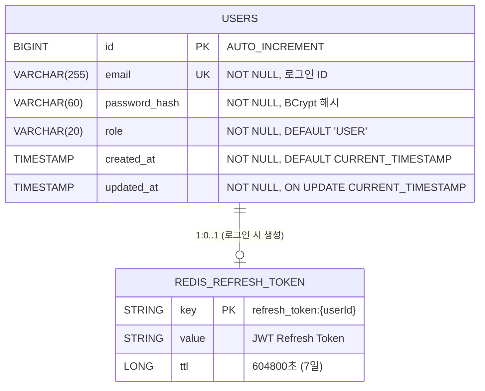
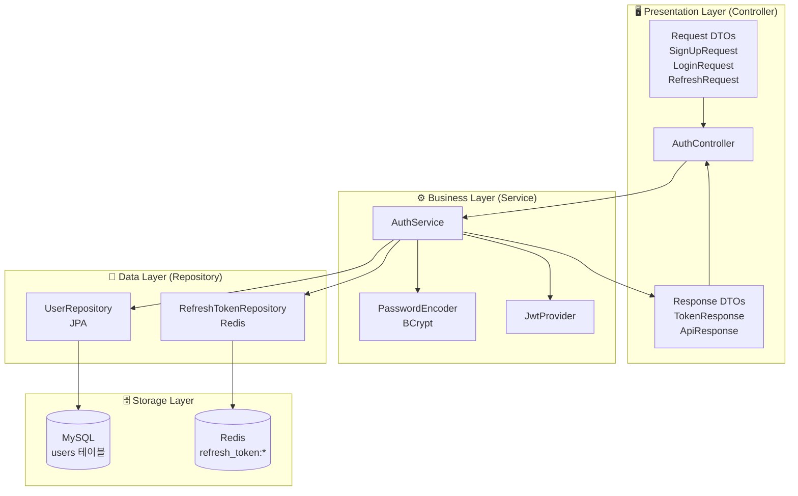
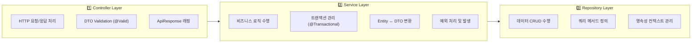
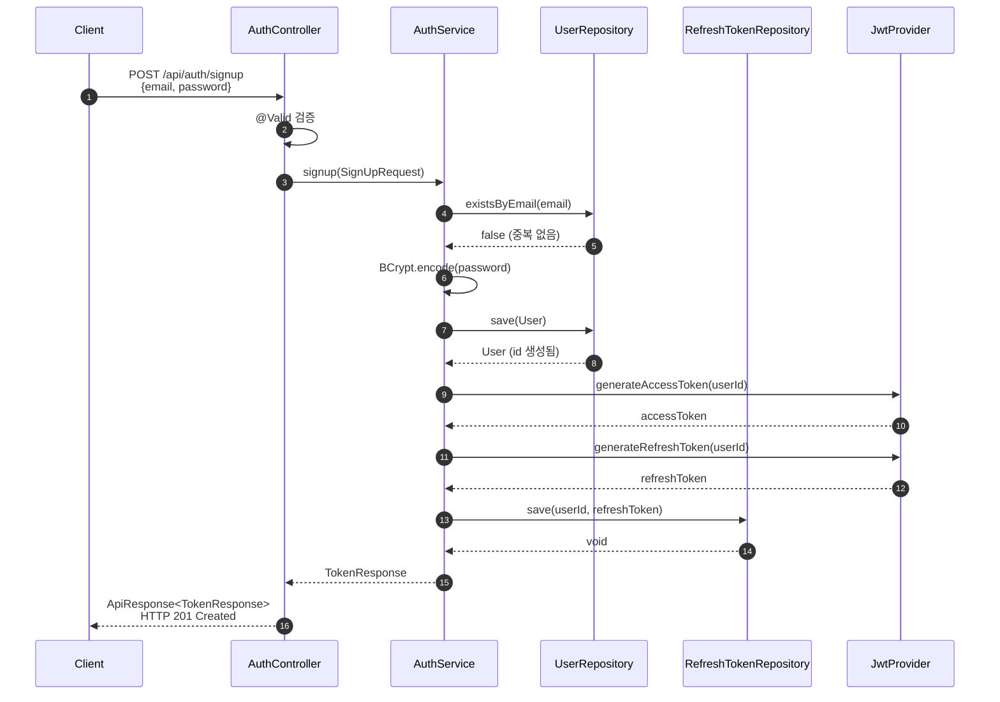
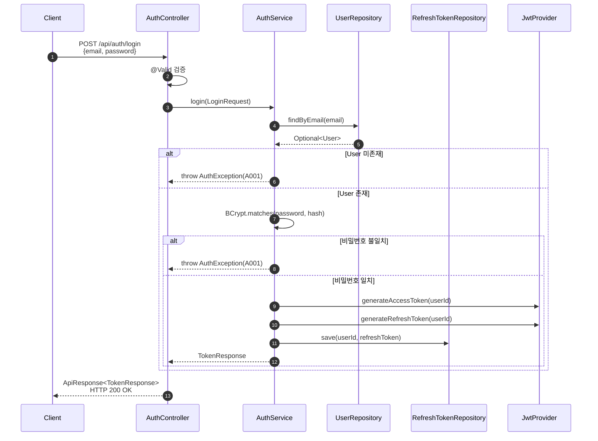
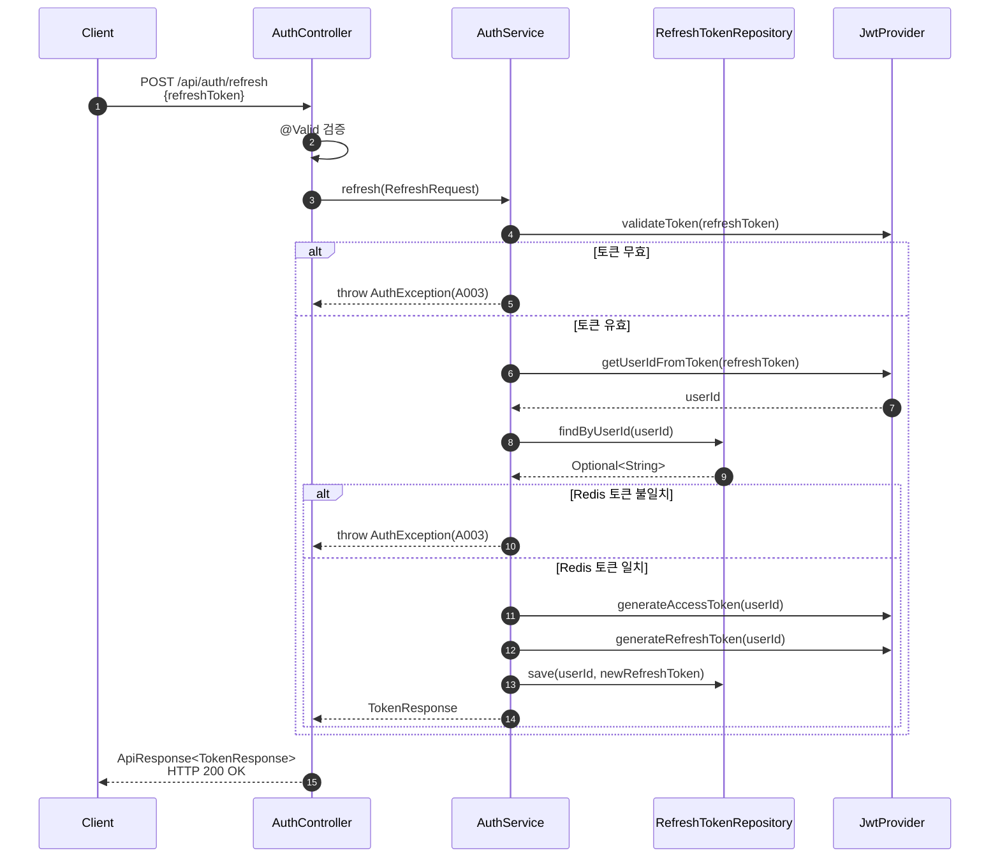
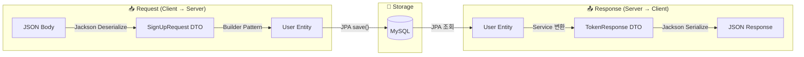
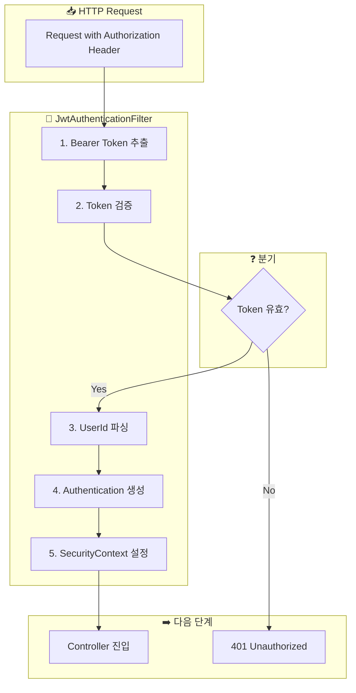
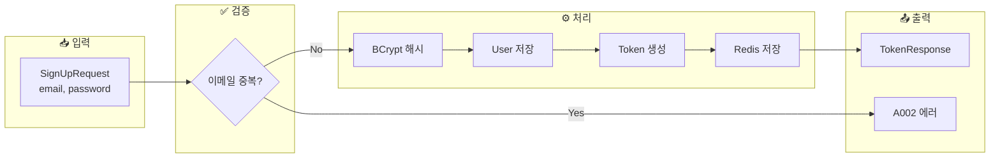
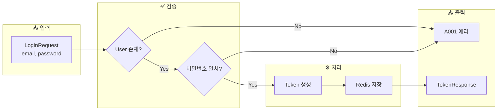

# [BE-003] 인증 로직 및 보안 설정

**Epic:** EPIC_AUTH  
**Priority:** Must  
**Effort:** L  
**Start Date:** 2026-02-01  
**Due Date:** 2026-02-02  
**Dependencies:** BE-001 (User Entity) ✅ 완료, BE-002 (Auth DTOs) ✅ 완료

---

## 목적 및 요약
- **목적**: 안전한 인증 시스템을 구축한다.
- **요약**: Spring Security 설정(FilterChain), `AuthService`(회원가입/로그인/토큰갱신), `JwtProvider`, `GlobalExceptionHandler` 구현.

### 구현 순서 (3-Tier 아키텍처 기반)

> **데이터(Repository) → 로직(Service) → 인터페이스(Controller)** 순서로 구현

| 순서 | 레이어 | 구현 컴포넌트 | 의존성 |
|:---:|-------|------------|--------|
| 1️⃣ | **Data Layer** | UserRepository, RefreshTokenRepository | ✅ BE-001 완료 |
| 2️⃣ | **Infrastructure** | JwtProvider, JwtAuthenticationFilter | JWT 라이브러리 |
| 3️⃣ | **Business Layer** | AuthService | Repository, JwtProvider |
| 4️⃣ | **Config** | SecurityConfig | JwtAuthenticationFilter |
| 5️⃣ | **Presentation** | AuthController 연결 | ✅ BE-002 스텁 완료 |
| 6️⃣ | **Exception** | GlobalExceptionHandler | ErrorCode |

## 관련 스펙
- **SRS ID**: REQ-FUNC-024, REQ-FUNC-025 (Business Layer)
- **Component**: Backend Logic
- **참조 규칙**: 
  - `.cursor/rules/307-api-design-exception-handling.mdc`
  - `.cursor/rules/308-spring-security-jwt-rules.mdc`

---

## 🗄️ ERD (Entity Relationship Diagram)

### 데이터베이스 관점: 데이터가 어떻게 저장될 것인가?



### 저장소 구분

| 저장소 | 용도 | 데이터 | 특징 |
|-------|-----|-------|-----|
| **MySQL (RDB)** | 사용자 정보 영속 저장 | User Entity | ACID 보장, JPA 관리 |
| **Redis (Cache)** | Refresh Token 임시 저장 | Key-Value | TTL 자동 만료, 빠른 조회 |

### 테이블 상세 정의 (DDL)

```sql
-- V1__create_users_table.sql
CREATE TABLE users (
    id BIGINT AUTO_INCREMENT PRIMARY KEY COMMENT '사용자 고유 ID',
    email VARCHAR(255) NOT NULL COMMENT '이메일 (로그인 ID)',
    password_hash VARCHAR(60) NOT NULL COMMENT 'BCrypt 해시 비밀번호',
    role VARCHAR(20) NOT NULL DEFAULT 'USER' COMMENT '사용자 권한 (USER, ADMIN)',
    created_at TIMESTAMP NOT NULL DEFAULT CURRENT_TIMESTAMP COMMENT '생성일시',
    updated_at TIMESTAMP NOT NULL DEFAULT CURRENT_TIMESTAMP 
               ON UPDATE CURRENT_TIMESTAMP COMMENT '수정일시',
    CONSTRAINT uk_users_email UNIQUE (email)
) ENGINE=InnoDB DEFAULT CHARSET=utf8mb4 COLLATE=utf8mb4_unicode_ci;
```

### Redis 저장 구조

```
┌─────────────────────────────────────────────────┐
│ Redis Key-Value Store                           │
├─────────────────────────────────────────────────┤
│ KEY: refresh_token:1                            │
│ VALUE: eyJhbGciOiJIUzI1NiIsInR5cCI6IkpXVCJ9... │
│ TTL: 604800 seconds (7 days)                    │
├─────────────────────────────────────────────────┤
│ KEY: refresh_token:2                            │
│ VALUE: eyJhbGciOiJIUzI1NiIsInR5cCI6IkpXVCJ9... │
│ TTL: 604800 seconds (7 days)                    │
└─────────────────────────────────────────────────┘
```

---

## 🏗️ CLD (Class/Component Logic Diagram)

### 백엔드 서버 관점: 데이터가 어떻게 가공될 것인가?



### 3-Tier 아키텍처 레이어별 책임



### 인증 흐름별 컴포넌트 상호작용

#### 회원가입 (POST /api/auth/signup)



#### 로그인 (POST /api/auth/login)



#### 토큰 갱신 (POST /api/auth/refresh)



---

## 📦 ORM 예제코드 (Object Relational Mapping)

### 서버 ↔ 데이터베이스 연결 관점

### 1. JPA Entity (User.java)

```java
/**
 * 사용자 엔티티 - MySQL users 테이블과 매핑
 * 
 * <h3>ORM 매핑 정보</h3>
 * <ul>
 *   <li>테이블명: users</li>
 *   <li>PK 전략: IDENTITY (AUTO_INCREMENT)</li>
 *   <li>UK: email (Unique Index)</li>
 *   <li>상속: BaseTimeEntity (createdAt, updatedAt 자동 관리)</li>
 * </ul>
 */
@Entity
@Table(name = "users", indexes = {
    @Index(name = "uk_users_email", columnList = "email", unique = true)
})
@Getter
@NoArgsConstructor(access = AccessLevel.PROTECTED)
public class User extends BaseTimeEntity {

    @Id
    @GeneratedValue(strategy = GenerationType.IDENTITY)
    private Long id;

    @Column(nullable = false, unique = true, length = 255)
    private String email;

    @Column(name = "password_hash", nullable = false, length = 60)
    private String passwordHash;

    @Enumerated(EnumType.STRING)
    @Column(nullable = false, length = 20)
    private Role role;

    @Builder
    public User(String email, String passwordHash, Role role) {
        this.email = email;
        this.passwordHash = passwordHash;
        this.role = (role != null) ? role : Role.USER;
    }
}
```

### 2. JPA Repository (UserRepository.java)

```java
/**
 * User Repository - Spring Data JPA 기반 데이터 접근 계층
 * 
 * <h3>생성되는 SQL</h3>
 * <ul>
 *   <li>findByEmail: SELECT * FROM users WHERE email = ?</li>
 *   <li>existsByEmail: SELECT COUNT(*) > 0 FROM users WHERE email = ?</li>
 *   <li>save: INSERT INTO users (...) VALUES (...)</li>
 * </ul>
 */
@Repository
public interface UserRepository extends JpaRepository<User, Long> {

    /**
     * 이메일로 사용자 조회
     * 
     * @param email 조회할 이메일
     * @return 사용자 Optional (존재하지 않으면 empty)
     * 
     * 생성 SQL:
     * SELECT u FROM User u WHERE u.email = :email
     */
    Optional<User> findByEmail(String email);

    /**
     * 이메일 존재 여부 확인 (회원가입 중복 체크용)
     * 
     * @param email 확인할 이메일
     * @return 존재 여부
     * 
     * 생성 SQL:
     * SELECT CASE WHEN COUNT(u) > 0 THEN TRUE ELSE FALSE END 
     * FROM User u WHERE u.email = :email
     */
    boolean existsByEmail(String email);
}
```

### 3. Redis Repository (RefreshTokenRepository.java)

```java
/**
 * RefreshToken Redis Repository - Redis 기반 토큰 저장소
 * 
 * <h3>Redis 명령어 매핑</h3>
 * <ul>
 *   <li>save: SET refresh_token:{userId} {token} EX 604800</li>
 *   <li>findByUserId: GET refresh_token:{userId}</li>
 *   <li>delete: DEL refresh_token:{userId}</li>
 *   <li>exists: EXISTS refresh_token:{userId}</li>
 * </ul>
 */
@Repository
@RequiredArgsConstructor
@Slf4j
public class RefreshTokenRepository {

    private static final String KEY_PREFIX = "refresh_token:";
    private static final long TTL_SECONDS = 604800L; // 7일

    private final RedisTemplate<String, String> redisTemplate;

    /**
     * RefreshToken 저장
     * 
     * Redis 명령어:
     * SET refresh_token:1 "eyJhbGciOiJIUzI1NiIs..." EX 604800
     */
    public void save(Long userId, String token) {
        String key = KEY_PREFIX + userId;
        redisTemplate.opsForValue().set(key, token, TTL_SECONDS, TimeUnit.SECONDS);
        log.debug("RefreshToken 저장: userId={}", userId);
    }

    /**
     * RefreshToken 조회
     * 
     * Redis 명령어:
     * GET refresh_token:1
     */
    public Optional<String> findByUserId(Long userId) {
        String key = KEY_PREFIX + userId;
        String token = redisTemplate.opsForValue().get(key);
        return Optional.ofNullable(token);
    }

    /**
     * RefreshToken 삭제 (로그아웃 시)
     * 
     * Redis 명령어:
     * DEL refresh_token:1
     */
    public void delete(Long userId) {
        String key = KEY_PREFIX + userId;
        redisTemplate.delete(key);
        log.debug("RefreshToken 삭제: userId={}", userId);
    }
}
```

### 4. Data Access 예제코드 (AuthService 내 실제 호출)

```java
/**
 * 회원가입 로직 - 데이터 접근 흐름
 * 
 * 실행 순서:
 * 1. MySQL SELECT (existsByEmail) → 이메일 중복 체크
 * 2. MySQL INSERT (save) → User 저장
 * 3. Redis SET (save) → RefreshToken 저장
 */
@Transactional
public TokenResponse signup(SignUpRequest request) {
    // 1. MySQL: SELECT COUNT(*) > 0 FROM users WHERE email = ?
    if (userRepository.existsByEmail(request.email())) {
        throw new AuthException(ErrorCode.EMAIL_ALREADY_EXISTS);
    }

    // 2. 비밀번호 해시
    String hashedPassword = passwordEncoder.encode(request.password());

    // 3. MySQL: INSERT INTO users (email, password_hash, role, ...) VALUES (?, ?, ?, ...)
    User user = User.builder()
        .email(request.email())
        .passwordHash(hashedPassword)
        .build();
    User savedUser = userRepository.save(user);

    // 4. JWT 토큰 생성
    String accessToken = jwtProvider.generateAccessToken(savedUser.getId());
    String refreshToken = jwtProvider.generateRefreshToken(savedUser.getId());

    // 5. Redis: SET refresh_token:{userId} {refreshToken} EX 604800
    refreshTokenRepository.save(savedUser.getId(), refreshToken);

    return new TokenResponse(accessToken, refreshToken, 
                             jwtProvider.getAccessTokenExpirationSeconds());
}
```

### 5. Entity ↔ DTO 변환 흐름



### 데이터 변환 코드 예시

```java
// ===== Request → Entity =====
// SignUpRequest DTO → User Entity
User user = User.builder()
    .email(request.email())
    .passwordHash(passwordEncoder.encode(request.password()))
    .build();

// ===== Entity → Response =====
// 인증 성공 후 TokenResponse 생성
return new TokenResponse(
    accessToken,    // JwtProvider에서 생성
    refreshToken,   // JwtProvider에서 생성
    expiresIn       // 설정값에서 로드
);
```

---

## 🔐 Security Architecture

### Endpoint 접근 정책 (308 규칙 준수)

| 경로 | 접근 권한 | 설명 |
|-----|---------|------|
| `POST /api/auth/signup` | **PUBLIC** | 회원가입 |
| `POST /api/auth/login` | **PUBLIC** | 로그인 |
| `POST /api/auth/refresh` | **PUBLIC** | 토큰 갱신 |
| `/api/docs/**` | **PUBLIC** | Swagger 문서 |
| `/swagger-ui/**` | **PUBLIC** | Swagger UI |
| `/api/**` (그 외) | **PROTECTED** | JWT 인증 필요 |

### Security Configuration 상세

```java
// SecurityConfig.java
@Configuration
@EnableWebSecurity
@RequiredArgsConstructor
public class SecurityConfig {

    private final JwtAuthenticationFilter jwtAuthenticationFilter;

    @Bean
    public SecurityFilterChain filterChain(HttpSecurity http) throws Exception {
        return http
            // CSRF 비활성화 (Stateless API)
            .csrf(AbstractHttpConfigurer::disable)
            
            // 세션 사용 안함 (308 규칙: STATELESS)
            .sessionManagement(session -> 
                session.sessionCreationPolicy(SessionCreationPolicy.STATELESS))
            
            // 경로별 인증 설정
            .authorizeHttpRequests(auth -> auth
                .requestMatchers("/api/auth/**").permitAll()
                .requestMatchers("/api/docs/**", "/swagger-ui/**", "/v3/api-docs/**").permitAll()
                .anyRequest().authenticated()
            )
            
            // JWT 필터 추가
            .addFilterBefore(jwtAuthenticationFilter, 
                UsernamePasswordAuthenticationFilter.class)
            
            .build();
    }

    @Bean
    public PasswordEncoder passwordEncoder() {
        return new BCryptPasswordEncoder();
    }
}
```

---

## 🔑 JWT Configuration

### 토큰 스펙

| 항목 | Access Token | Refresh Token |
|-----|-------------|---------------|
| **만료 시간** | 30분 (1800초) | 7일 (604800초) |
| **저장 위치** | Client (메모리/Keychain) | Redis |
| **용도** | API 인증 | Access Token 갱신 |
| **알고리즘** | HS256 | HS256 |

### 환경변수 설정 (application.yml)

```yaml
jwt:
  secret: ${JWT_SECRET_KEY}  # 최소 256bit (32자 이상)
  access-token-expiration: 1800   # 30분 (초)
  refresh-token-expiration: 604800  # 7일 (초)
```

### 의존성 추가 (build.gradle)

```groovy
// JWT 라이브러리
implementation 'io.jsonwebtoken:jjwt-api:0.12.3'
runtimeOnly 'io.jsonwebtoken:jjwt-impl:0.12.3'
runtimeOnly 'io.jsonwebtoken:jjwt-jackson:0.12.3'

// Spring Security
implementation 'org.springframework.boot:spring-boot-starter-security'
testImplementation 'org.springframework.security:spring-security-test'
```

---

## 🔄 데이터 흐름 다이어그램

### JWT 인증 필터 흐름



### 회원가입 로직 흐름 (AuthService.signup)



### 로그인 로직 흐름 (AuthService.login)



### 토큰 갱신 로직 흐름 (AuthService.refresh)


---

## 💻 구현 상세 코드

### 1. JwtProvider

```java
/**
 * JWT 토큰 생성 및 검증 Provider
 * 
 * <p>Access Token과 Refresh Token을 생성하고 검증합니다.
 * Secret Key는 환경변수에서 로드됩니다.</p>
 */
@Component
@Slf4j
public class JwtProvider {

    private final SecretKey secretKey;
    private final long accessTokenExpiration;
    private final long refreshTokenExpiration;

    public JwtProvider(
            @Value("${jwt.secret}") String secret,
            @Value("${jwt.access-token-expiration}") long accessTokenExpiration,
            @Value("${jwt.refresh-token-expiration}") long refreshTokenExpiration) {
        this.secretKey = Keys.hmacShaKeyFor(secret.getBytes(StandardCharsets.UTF_8));
        this.accessTokenExpiration = accessTokenExpiration * 1000; // ms 변환
        this.refreshTokenExpiration = refreshTokenExpiration * 1000;
    }

    /**
     * Access Token 생성
     */
    public String generateAccessToken(Long userId) {
        return generateToken(userId, accessTokenExpiration);
    }

    /**
     * Refresh Token 생성
     */
    public String generateRefreshToken(Long userId) {
        return generateToken(userId, refreshTokenExpiration);
    }

    /**
     * 토큰에서 UserId 추출
     */
    public Long getUserIdFromToken(String token) {
        Claims claims = parseClaims(token);
        return Long.parseLong(claims.getSubject());
    }

    /**
     * 토큰 유효성 검증
     */
    public boolean validateToken(String token) {
        try {
            parseClaims(token);
            return true;
        } catch (ExpiredJwtException e) {
            log.warn("만료된 JWT 토큰");
        } catch (MalformedJwtException e) {
            log.warn("잘못된 형식의 JWT 토큰");
        } catch (UnsupportedJwtException e) {
            log.warn("지원하지 않는 JWT 토큰");
        } catch (SignatureException e) {
            log.warn("유효하지 않은 JWT 서명");
        }
        return false;
    }

    /**
     * Access Token 만료 시간 반환 (초 단위)
     */
    public long getAccessTokenExpirationSeconds() {
        return accessTokenExpiration / 1000;
    }

    private String generateToken(Long userId, long expirationMs) {
        Date now = new Date();
        Date expiry = new Date(now.getTime() + expirationMs);

        return Jwts.builder()
            .subject(String.valueOf(userId))
            .issuedAt(now)
            .expiration(expiry)
            .signWith(secretKey)
            .compact();
    }

    private Claims parseClaims(String token) {
        return Jwts.parser()
            .verifyWith(secretKey)
            .build()
            .parseSignedClaims(token)
            .getPayload();
    }
}
```

### 2. JwtAuthenticationFilter

```java
/**
 * JWT 인증 필터
 * 
 * <p>Authorization 헤더에서 JWT를 추출하여 인증을 수행합니다.
 * UsernamePasswordAuthenticationFilter 이전에 실행됩니다.</p>
 */
@Component
@RequiredArgsConstructor
@Slf4j
public class JwtAuthenticationFilter extends OncePerRequestFilter {

    private static final String AUTHORIZATION_HEADER = "Authorization";
    private static final String BEARER_PREFIX = "Bearer ";

    private final JwtProvider jwtProvider;

    @Override
    protected void doFilterInternal(
            HttpServletRequest request,
            HttpServletResponse response,
            FilterChain filterChain) throws ServletException, IOException {

        // 1. Authorization 헤더에서 토큰 추출
        String token = extractToken(request);

        // 2. 토큰이 존재하고 유효하면 인증 설정
        if (token != null && jwtProvider.validateToken(token)) {
            Long userId = jwtProvider.getUserIdFromToken(token);
            
            // 3. Authentication 객체 생성
            UsernamePasswordAuthenticationToken authentication =
                new UsernamePasswordAuthenticationToken(userId, null, List.of());

            // 4. SecurityContext에 설정
            SecurityContextHolder.getContext().setAuthentication(authentication);
            
            log.debug("JWT 인증 성공: userId={}", userId);
        }

        // 5. 다음 필터로 진행
        filterChain.doFilter(request, response);
    }

    private String extractToken(HttpServletRequest request) {
        String header = request.getHeader(AUTHORIZATION_HEADER);
        if (header != null && header.startsWith(BEARER_PREFIX)) {
            return header.substring(BEARER_PREFIX.length());
        }
        return null;
    }
}
```

### 3. AuthService

```java
/**
 * 인증 서비스
 * 
 * <p>회원가입, 로그인, 토큰 갱신 비즈니스 로직을 담당합니다.</p>
 */
@Service
@RequiredArgsConstructor
@Transactional(readOnly = true)
@Slf4j
public class AuthService {

    private final UserRepository userRepository;
    private final RefreshTokenRepository refreshTokenRepository;
    private final PasswordEncoder passwordEncoder;
    private final JwtProvider jwtProvider;

    /**
     * 회원가입
     * 
     * <h3>로직 순서</h3>
     * <ol>
     *   <li>이메일 중복 체크</li>
     *   <li>비밀번호 BCrypt 해시</li>
     *   <li>User 엔티티 저장</li>
     *   <li>Access/Refresh Token 발급</li>
     *   <li>Refresh Token Redis 저장</li>
     * </ol>
     * 
     * @param request 회원가입 요청 DTO
     * @return TokenResponse (accessToken, refreshToken, expiresIn)
     * @throws AuthException EMAIL_ALREADY_EXISTS (A002)
     */
    @Transactional
    public TokenResponse signup(SignUpRequest request) {
        // 1. 이메일 중복 체크
        if (userRepository.existsByEmail(request.email())) {
            throw new AuthException(ErrorCode.EMAIL_ALREADY_EXISTS);
        }

        // 2. 비밀번호 BCrypt 해시
        String hashedPassword = passwordEncoder.encode(request.password());

        // 3. User 엔티티 저장
        User user = User.builder()
            .email(request.email())
            .passwordHash(hashedPassword)
            .build();
        User savedUser = userRepository.save(user);
        
        log.info("회원가입 완료: userId={}, email={}", savedUser.getId(), savedUser.getEmail());

        // 4-5. Token 발급 및 저장
        return generateAndSaveTokens(savedUser.getId());
    }

    /**
     * 로그인
     * 
     * <h3>로직 순서</h3>
     * <ol>
     *   <li>이메일로 사용자 조회</li>
     *   <li>비밀번호 BCrypt 검증</li>
     *   <li>Access/Refresh Token 발급</li>
     *   <li>Refresh Token Redis 저장</li>
     * </ol>
     * 
     * @param request 로그인 요청 DTO
     * @return TokenResponse
     * @throws AuthException INVALID_CREDENTIALS (A001)
     */
    @Transactional
    public TokenResponse login(LoginRequest request) {
        // 1. 이메일로 사용자 조회
        User user = userRepository.findByEmail(request.email())
            .orElseThrow(() -> new AuthException(ErrorCode.INVALID_CREDENTIALS));

        // 2. 비밀번호 BCrypt 검증
        if (!passwordEncoder.matches(request.password(), user.getPasswordHash())) {
            throw new AuthException(ErrorCode.INVALID_CREDENTIALS);
        }

        log.info("로그인 성공: userId={}, email={}", user.getId(), user.getEmail());

        // 3-4. Token 발급 및 저장
        return generateAndSaveTokens(user.getId());
    }

    /**
     * 토큰 갱신
     * 
     * <h3>로직 순서</h3>
     * <ol>
     *   <li>Refresh Token 유효성 검증</li>
     *   <li>Token에서 UserId 추출</li>
     *   <li>Redis 저장 토큰과 비교</li>
     *   <li>새 Access/Refresh Token 발급</li>
     *   <li>새 Refresh Token Redis 저장</li>
     * </ol>
     * 
     * @param request 토큰 갱신 요청 DTO
     * @return TokenResponse
     * @throws AuthException INVALID_REFRESH_TOKEN (A003)
     */
    @Transactional
    public TokenResponse refresh(RefreshRequest request) {
        // 1. Refresh Token 유효성 검증
        if (!jwtProvider.validateToken(request.refreshToken())) {
            throw new AuthException(ErrorCode.INVALID_REFRESH_TOKEN);
        }

        // 2. Token에서 UserId 추출
        Long userId = jwtProvider.getUserIdFromToken(request.refreshToken());

        // 3. Redis 저장 토큰과 비교
        String storedToken = refreshTokenRepository.findByUserId(userId)
            .orElseThrow(() -> new AuthException(ErrorCode.INVALID_REFRESH_TOKEN));

        if (!storedToken.equals(request.refreshToken())) {
            throw new AuthException(ErrorCode.INVALID_REFRESH_TOKEN);
        }

        log.info("토큰 갱신: userId={}", userId);

        // 4-5. 새 Token 발급 및 저장
        return generateAndSaveTokens(userId);
    }

    /**
     * Token 생성 및 Redis 저장 (Private Helper)
     */
    private TokenResponse generateAndSaveTokens(Long userId) {
        String accessToken = jwtProvider.generateAccessToken(userId);
        String refreshToken = jwtProvider.generateRefreshToken(userId);

        // Redis에 Refresh Token 저장 (TTL: 7일)
        refreshTokenRepository.save(userId, refreshToken);

        return new TokenResponse(
            accessToken,
            refreshToken,
            jwtProvider.getAccessTokenExpirationSeconds()
        );
    }
}
```

### 4. GlobalExceptionHandler

```java
/**
 * 전역 예외 핸들러
 * 
 * <p>API 예외를 표준 응답 포맷으로 변환합니다 (307 규칙 준수).</p>
 */
@RestControllerAdvice
@Slf4j
public class GlobalExceptionHandler {

    /**
     * 비즈니스 예외 처리 (AuthException 등)
     */
    @ExceptionHandler(BusinessException.class)
    public ResponseEntity<ApiResponse<Void>> handleBusinessException(BusinessException e) {
        log.warn("비즈니스 예외: {}", e.getMessage());
        return ResponseEntity
            .status(e.getErrorCode().getStatus())
            .body(ApiResponse.error(e.getErrorCode()));
    }

    /**
     * Validation 예외 처리 (MethodArgumentNotValidException)
     */
    @ExceptionHandler(MethodArgumentNotValidException.class)
    public ResponseEntity<ApiResponse<Void>> handleValidationException(
            MethodArgumentNotValidException e) {
        log.warn("Validation 예외: {}", e.getMessage());
        return ResponseEntity
            .status(HttpStatus.BAD_REQUEST)
            .body(ApiResponse.error(ErrorCode.INVALID_INPUT));
    }

    /**
     * 그 외 예외 처리 (500 Server Error)
     */
    @ExceptionHandler(Exception.class)
    public ResponseEntity<ApiResponse<Void>> handleException(Exception e) {
        log.error("서버 에러", e);
        return ResponseEntity
            .status(HttpStatus.INTERNAL_SERVER_ERROR)
            .body(ApiResponse.error(ErrorCode.INTERNAL_SERVER_ERROR));
    }
}
```

### 5. Custom Exception 클래스

```java
/**
 * 비즈니스 예외 기본 클래스
 */
@Getter
public class BusinessException extends RuntimeException {
    private final ErrorCode errorCode;

    public BusinessException(ErrorCode errorCode) {
        super(errorCode.getMessage());
        this.errorCode = errorCode;
    }
}

/**
 * 인증 관련 예외
 */
public class AuthException extends BusinessException {
    public AuthException(ErrorCode errorCode) {
        super(errorCode);
    }
}
```

---

## 📁 패키지 구조

```
com.wombat.screenlock.unwind_be
├── api
│   └── auth
│       ├── controller
│       │   └── AuthController.java        ✅ BE-002에서 스텁 구현됨
│       └── dto
│           ├── SignUpRequest.java         ✅ BE-002에서 구현됨
│           ├── LoginRequest.java          ✅ BE-002에서 구현됨
│           ├── RefreshRequest.java        ✅ BE-002에서 구현됨
│           └── TokenResponse.java         ✅ BE-002에서 구현됨
├── application
│   └── auth
│       └── AuthService.java               ← 이 이슈에서 구현
├── config
│   └── SecurityConfig.java                ← 이 이슈에서 구현
├── domain
│   └── user
│       ├── entity/User.java               ✅ BE-001에서 완료
│       └── repository/UserRepository.java ✅ BE-001에서 완료
├── global
│   ├── exception
│   │   ├── BusinessException.java         ← 이 이슈에서 구현
│   │   ├── AuthException.java             ← 이 이슈에서 구현
│   │   └── ErrorCode.java                 ✅ BE-002에서 구현됨 (확장 필요)
│   ├── handler
│   │   └── GlobalExceptionHandler.java    ← 이 이슈에서 구현
│   └── response
│       ├── ApiResponse.java               ✅ BE-002에서 구현됨
│       └── ErrorResponse.java             ✅ BE-002에서 구현됨
└── infrastructure
    ├── jwt
    │   ├── JwtProvider.java               ← 이 이슈에서 구현
    │   └── JwtAuthenticationFilter.java   ← 이 이슈에서 구현
    └── redis
        └── RefreshTokenRepository.java    ✅ BE-001에서 완료
```

---

## ✅ Definition of Done (DoD)

### 📐 아키텍처 설계 문서
- [x] **ERD** (Entity Relationship Diagram) 작성
  - [x] users 테이블 정의 (컬럼, PK, UK, 데이터타입)
  - [x] Redis refresh_token 저장 구조 정의
  - [x] 저장소별 역할 분리 문서화 (MySQL vs Redis)
- [x] **CLD** (Class/Component Logic Diagram) 작성
  - [x] 3-Tier 아키텍처 컴포넌트 다이어그램
  - [x] 회원가입/로그인/토큰갱신 시퀀스 다이어그램
  - [x] 레이어별 책임 정의
- [x] **ORM 예제코드** 작성
  - [x] JPA Entity 코드 (User.java)
  - [x] JPA Repository 코드 (UserRepository.java)
  - [x] Redis Repository 코드 (RefreshTokenRepository.java)
  - [x] 데이터 접근 흐름 예제 (AuthService 내)

### Security 설정
- [ ] `SecurityConfig` 구현
  - [ ] CSRF 비활성화
  - [ ] SessionCreationPolicy.STATELESS 설정
  - [ ] `/api/auth/**` permitAll() 설정
  - [ ] 그 외 경로 authenticated() 설정
  - [ ] BCryptPasswordEncoder Bean 등록

### JWT 구현
- [ ] `JwtProvider` 구현
  - [ ] Access Token 생성 (30분 만료)
  - [ ] Refresh Token 생성 (7일 만료)
  - [ ] Token 검증 (서명, 만료, 형식)
  - [ ] UserId 추출
  - [ ] Secret Key 환경변수 로드

### 인증 필터
- [ ] `JwtAuthenticationFilter` 구현
  - [ ] Authorization 헤더에서 Bearer 토큰 추출
  - [ ] SecurityContext에 Authentication 설정
  - [ ] 유효하지 않은 토큰 시 무시 (다음 필터 진행)

### AuthService
- [ ] `signup()` 구현
  - [ ] 이메일 중복 체크 → A002 예외
  - [ ] BCrypt 해시 후 User 저장
  - [ ] Token 발급 및 Redis 저장
- [ ] `login()` 구현
  - [ ] 이메일로 User 조회 → 없으면 A001 예외
  - [ ] BCrypt 비밀번호 검증 → 불일치 시 A001 예외
  - [ ] Token 발급 및 Redis 저장
- [ ] `refresh()` 구현
  - [ ] Token 유효성 검증 → 실패 시 A003 예외
  - [ ] Redis 저장 토큰과 비교 → 불일치 시 A003 예외
  - [ ] 새 Token 발급 및 Redis 갱신

### 예외 처리
- [ ] `BusinessException`, `AuthException` 구현
- [ ] `GlobalExceptionHandler` 구현
  - [ ] BusinessException → 적절한 HTTP Status
  - [ ] MethodArgumentNotValidException → 400
  - [ ] Exception → 500
- [ ] ErrorCode 확장 (INTERNAL_SERVER_ERROR 추가)

### Controller 연결
- [ ] AuthController에 AuthService 주입
- [ ] 스텁 메서드 → 실제 로직 연결

---

## 🧪 테스트

### Unit Test

#### JwtProviderTest
```java
@DisplayName("JwtProvider 테스트")
class JwtProviderTest {
    
    @Test
    void should_GenerateValidAccessToken() { }
    
    @Test
    void should_GenerateValidRefreshToken() { }
    
    @Test
    void should_ExtractUserIdFromToken() { }
    
    @Test
    void should_ReturnFalse_When_TokenExpired() { }
    
    @Test
    void should_ReturnFalse_When_TokenMalformed() { }
    
    @Test
    void should_ReturnFalse_When_SignatureInvalid() { }
}
```

#### AuthServiceTest
```java
@DisplayName("AuthService 테스트")
@ExtendWith(MockitoExtension.class)
class AuthServiceTest {
    
    @Mock UserRepository userRepository;
    @Mock RefreshTokenRepository refreshTokenRepository;
    @Mock PasswordEncoder passwordEncoder;
    @Mock JwtProvider jwtProvider;
    @InjectMocks AuthService authService;
    
    @Nested
    @DisplayName("회원가입")
    class Signup {
        @Test void should_ReturnToken_When_ValidRequest() { }
        @Test void should_ThrowA002_When_EmailDuplicated() { }
    }
    
    @Nested
    @DisplayName("로그인")
    class Login {
        @Test void should_ReturnToken_When_ValidCredentials() { }
        @Test void should_ThrowA001_When_UserNotFound() { }
        @Test void should_ThrowA001_When_PasswordMismatch() { }
    }
    
    @Nested
    @DisplayName("토큰 갱신")
    class Refresh {
        @Test void should_ReturnNewToken_When_ValidRefreshToken() { }
        @Test void should_ThrowA003_When_TokenInvalid() { }
        @Test void should_ThrowA003_When_TokenNotInRedis() { }
    }
}
```

### Integration Test

#### AuthIntegrationTest
```java
@SpringBootTest
@AutoConfigureMockMvc
@DisplayName("인증 통합 테스트")
class AuthIntegrationTest {
    
    @Autowired MockMvc mockMvc;
    
    @Test
    void should_SignupAndReturnToken() { }
    
    @Test
    void should_LoginAndReturnToken() { }
    
    @Test
    void should_RefreshToken() { }
    
    @Test
    void should_Return401_When_InvalidCredentials() { }
}
```

---

## 📊 난이도 분석

| 컴포넌트 | 난이도 | 예상 시간 | 비고 |
|----------|-------|----------|-----|
| 📐 ERD/CLD/ORM 문서화 | ✅ 완료 | - | 아키텍처 설계 문서 |
| SecurityConfig | 중 | 1h | FilterChain 구성 |
| JwtProvider | 상 | 2h | 토큰 생성/검증/파싱 |
| JwtAuthenticationFilter | 상 | 1.5h | Spring Security 통합 |
| AuthService | 중 | 2h | BE-002 DTO 연결 |
| GlobalExceptionHandler | 하 | 1h | 패턴 적용 |
| 테스트 | 중 | 2h | Unit + Integration |
| **총합** | **L** | **~10h** | |

---

**Labels:** `backend`, `must`, `phase-1`  
**Milestone:** v1.0-MVP
