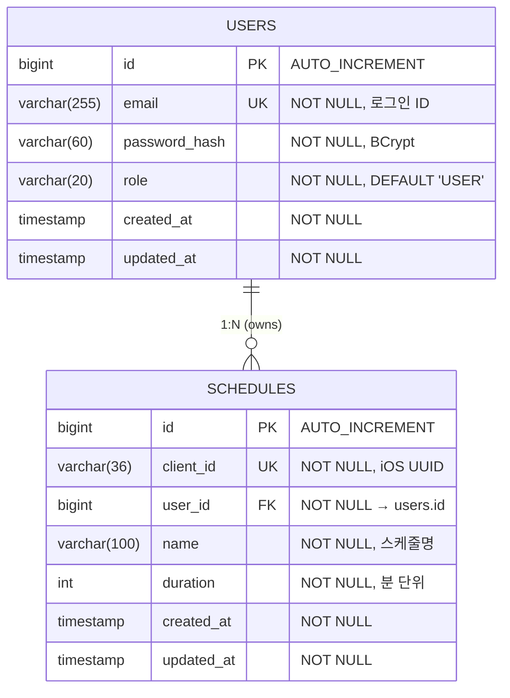
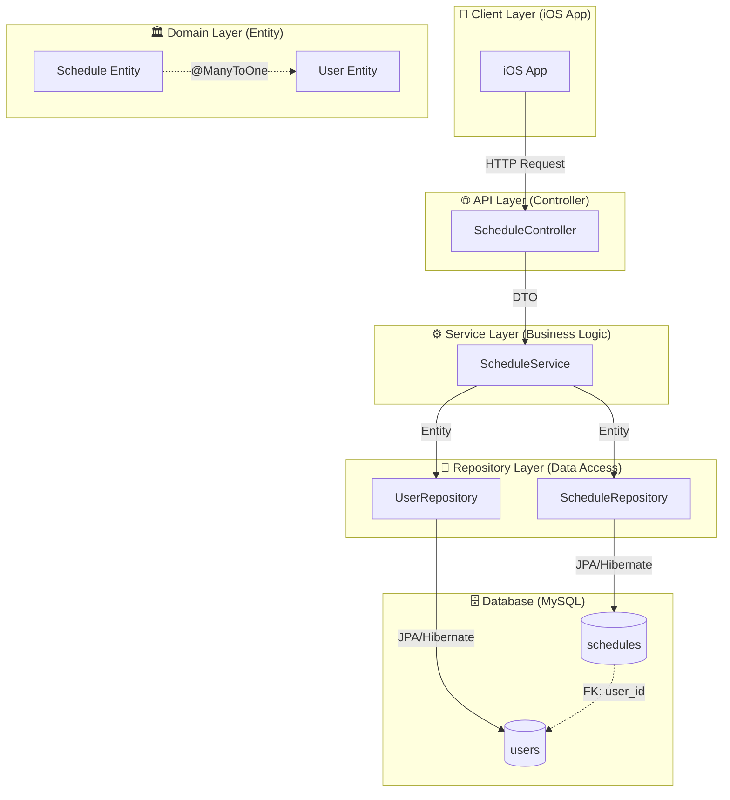
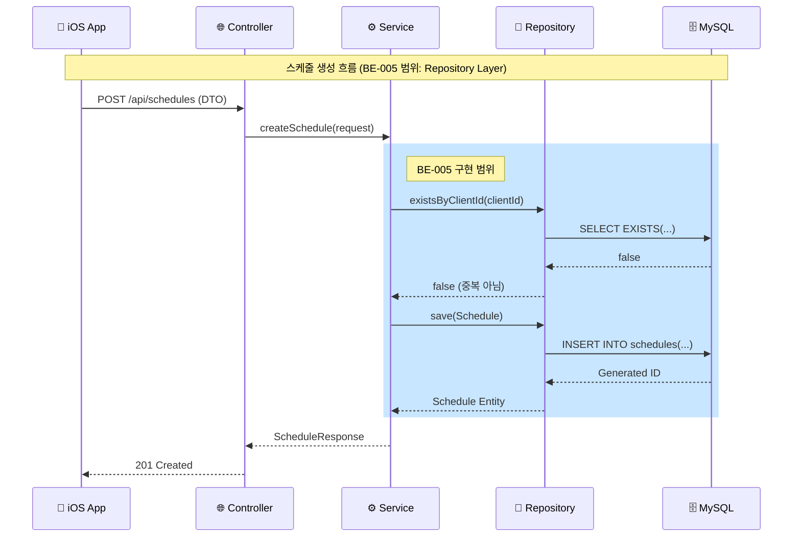

# [BE-005] Schedule Entity 데이터 모델링

**Epic:** EPIC_SCHEDULE_MGMT  
**Priority:** Must  
**Effort:** S (Small - 1일)  
**Difficulty:** 하  
**Start Date:** 2026-02-05  
**Due Date:** 2026-02-05  
**Dependencies:** BE-001 (User Entity)

---

## 목적 및 요약

- **목적**: 스케줄 데이터를 영속적으로 저장하기 위한 DB 구조를 정의한다.
- **요약**: `Schedule` 엔티티와 `User` 엔티티 간의 연관관계를 매핑하고, JPA Repository를 구현한다.

## 관련 스펙 (SRS)

- **ID**: REQ-FUNC-001 (Data Layer)
- **Component**: Backend DB (MySQL 8.0 / JPA + Hibernate)

---

## 🗂️ ERD (Entity Relationship Diagram)

> **데이터베이스 관점**: 데이터가 어떻게 저장될 것인가?



### ERD 상세 설명

| 관계 | 설명 |
|------|------|
| `USERS` → `SCHEDULES` | **1:N (One-to-Many)**: 한 사용자가 여러 스케줄 소유 |
| `client_id` | iOS 앱에서 생성한 UUID, 서버와 동기화 시 식별자 역할 |
| `ON DELETE CASCADE` | User 삭제 시 해당 사용자의 모든 Schedule 자동 삭제 |

### 테이블 관계 흐름

```
┌─────────────────┐          ┌──────────────────────┐
│     USERS       │          │      SCHEDULES       │
├─────────────────┤          ├──────────────────────┤
│ id (PK)     ────┼──────────┼─► user_id (FK)       │
│ email (UK)      │    1:N   │ client_id (UK)       │
│ password_hash   │          │ name                 │
│ role            │          │ duration             │
│ created_at      │          │ created_at           │
│ updated_at      │          │ updated_at           │
└─────────────────┘          └──────────────────────┘
```

---

## 🔄 CLD (Class/Component Logic Diagram)

> **백엔드 서버 관점**: 데이터가 어떻게 가공될 것인가?

### 3-Tier Architecture Flow



### 데이터 흐름 상세 (Create Schedule)



### Component 책임 분리

```
┌─────────────────────────────────────────────────────────────────┐
│                    3-Tier Architecture                          │
├─────────────────┬───────────────────┬───────────────────────────┤
│   Controller    │     Service       │       Repository          │
│   (Interface)   │     (Logic)       │       (Data Access)       │
├─────────────────┼───────────────────┼───────────────────────────┤
│ • HTTP 요청 수신  │ • 비즈니스 로직     │ • DB 쿼리 실행            │
│ • DTO 변환       │ • 트랜잭션 관리     │ • Entity ↔ Table 매핑     │
│ • 응답 반환      │ • 유효성 검증       │ • CRUD 메서드 제공        │
│ • 인증/인가 처리  │ • Entity 조합      │ • 쿼리 메서드 정의        │
├─────────────────┼───────────────────┼───────────────────────────┤
│ BE-006, BE-007  │     BE-007        │      ★ BE-005 ★          │
└─────────────────┴───────────────────┴───────────────────────────┘
```

---

## 📦 ORM 예제 코드 (Object-Relational Mapping)

> **서버가 데이터베이스를 조회하는 연결적 관점**

### 1. BaseTimeEntity (공통 Auditing)

```java
package com.wombat.screenlock.unwind_be.domain.common;

import jakarta.persistence.Column;
import jakarta.persistence.EntityListeners;
import jakarta.persistence.MappedSuperclass;
import lombok.Getter;
import org.springframework.data.annotation.CreatedDate;
import org.springframework.data.annotation.LastModifiedDate;
import org.springframework.data.jpa.domain.support.AuditingEntityListener;

import java.time.LocalDateTime;

/**
 * 공통 시간 필드 추상 클래스
 * 
 * <p>모든 엔티티가 상속하여 createdAt, updatedAt 자동 관리</p>
 */
@MappedSuperclass
@EntityListeners(AuditingEntityListener.class)
@Getter
public abstract class BaseTimeEntity {

    @CreatedDate
    @Column(updatable = false, nullable = false)
    private LocalDateTime createdAt;

    @LastModifiedDate
    @Column(nullable = false)
    private LocalDateTime updatedAt;
}
```

### 2. Schedule Entity (JPA Entity)

```java
package com.wombat.screenlock.unwind_be.domain.schedule.entity;

import com.wombat.screenlock.unwind_be.domain.common.BaseTimeEntity;
import com.wombat.screenlock.unwind_be.domain.user.entity.User;
import jakarta.persistence.*;
import lombok.AccessLevel;
import lombok.Builder;
import lombok.Getter;
import lombok.NoArgsConstructor;

/**
 * 스케줄 엔티티
 * 
 * <p>사용자의 집중 스케줄 정보를 저장합니다.
 * iOS 앱에서 생성한 clientId를 통해 동기화 식별자 역할을 합니다.</p>
 * 
 * <h3>테이블 정보</h3>
 * <ul>
 *   <li>테이블명: schedules</li>
 *   <li>PK: id (AUTO_INCREMENT)</li>
 *   <li>UK: client_id (Unique Index)</li>
 *   <li>FK: user_id → users.id</li>
 * </ul>
 * 
 * @see User
 * @see BaseTimeEntity
 */
@Entity
@Table(name = "schedules", indexes = {
    @Index(name = "uk_schedules_client_id", columnList = "client_id", unique = true),
    @Index(name = "idx_schedules_user_id", columnList = "user_id")
})
@Getter
@NoArgsConstructor(access = AccessLevel.PROTECTED)
public class Schedule extends BaseTimeEntity {

    /**
     * 스케줄 고유 ID (PK)
     */
    @Id
    @GeneratedValue(strategy = GenerationType.IDENTITY)
    private Long id;

    /**
     * 클라이언트 동기화 ID
     * <p>iOS 앱에서 생성한 UUID (36자)</p>
     */
    @Column(name = "client_id", nullable = false, unique = true, length = 36)
    private String clientId;

    /**
     * 스케줄 이름
     */
    @Column(nullable = false, length = 100)
    private String name;

    /**
     * 집중 시간 (분 단위)
     * <p>1분 ~ 480분 (8시간) 범위</p>
     */
    @Column(nullable = false)
    private Integer duration;

    /**
     * 소유 사용자
     * <p>N:1 관계, Lazy Loading 적용</p>
     */
    @ManyToOne(fetch = FetchType.LAZY)
    @JoinColumn(name = "user_id", nullable = false)
    private User user;

    /**
     * Schedule 엔티티 생성자
     * 
     * @param clientId iOS에서 생성한 UUID
     * @param name 스케줄 이름
     * @param duration 집중 시간 (분)
     * @param user 소유 사용자
     */
    @Builder
    public Schedule(String clientId, String name, Integer duration, User user) {
        this.clientId = clientId;
        this.name = name;
        this.duration = duration;
        this.user = user;
    }

    // ========== 비즈니스 메서드 ==========

    /**
     * 스케줄 정보 수정
     * 
     * @param name 새 스케줄 이름
     * @param duration 새 집중 시간 (분)
     */
    public void update(String name, Integer duration) {
        this.name = name;
        this.duration = duration;
    }
}
```

### 3. ScheduleRepository (Data Access Layer)

```java
package com.wombat.screenlock.unwind_be.domain.schedule.repository;

import com.wombat.screenlock.unwind_be.domain.schedule.entity.Schedule;
import org.springframework.data.domain.Page;
import org.springframework.data.domain.Pageable;
import org.springframework.data.jpa.repository.JpaRepository;
import org.springframework.data.jpa.repository.Query;
import org.springframework.data.repository.query.Param;
import org.springframework.stereotype.Repository;

import java.util.List;
import java.util.Optional;

/**
 * Schedule 엔티티 Repository
 * 
 * <p>JPA 기반 데이터 접근 계층으로, Spring Data JPA Query Method를 활용합니다.</p>
 * 
 * <h3>제공 기능</h3>
 * <ul>
 *   <li>기본 CRUD (JpaRepository 상속)</li>
 *   <li>클라이언트 ID로 스케줄 조회</li>
 *   <li>사용자별 스케줄 목록 조회</li>
 * </ul>
 * 
 * @see Schedule
 */
@Repository
public interface ScheduleRepository extends JpaRepository<Schedule, Long> {

    // ========== 클라이언트 ID 기반 조회 (iOS 동기화) ==========

    /**
     * 클라이언트 ID로 스케줄 조회
     * 
     * <p>iOS 앱 동기화 시 사용</p>
     * 
     * @param clientId iOS에서 생성한 UUID
     * @return 스케줄 Optional (존재하지 않으면 empty)
     */
    Optional<Schedule> findByClientId(String clientId);

    /**
     * 클라이언트 ID 존재 여부 확인
     * 
     * <p>스케줄 생성 시 중복 체크에 사용</p>
     * 
     * @param clientId 확인할 클라이언트 ID
     * @return 존재 여부 (true: 존재, false: 미존재)
     */
    boolean existsByClientId(String clientId);

    // ========== 사용자 기반 조회 ==========

    /**
     * 사용자 ID로 스케줄 목록 조회
     * 
     * @param userId 사용자 ID
     * @return 스케줄 목록
     */
    List<Schedule> findByUserId(Long userId);

    /**
     * 사용자별 스케줄 목록 조회 (페이징)
     * 
     * @param userId 사용자 ID
     * @param pageable 페이징 정보
     * @return 페이징된 스케줄 목록
     */
    Page<Schedule> findByUserId(Long userId, Pageable pageable);

    /**
     * 사용자의 스케줄 개수 조회
     * 
     * @param userId 사용자 ID
     * @return 스케줄 개수
     */
    long countByUserId(Long userId);

    // ========== 벌크 조회 (동기화용) ==========

    /**
     * 여러 클라이언트 ID로 스케줄 일괄 조회
     * 
     * <p>iOS 앱 일괄 동기화 시 사용</p>
     * 
     * @param clientIds 클라이언트 ID 목록
     * @return 스케줄 목록
     */
    @Query("SELECT s FROM Schedule s WHERE s.clientId IN :clientIds")
    List<Schedule> findByClientIdIn(@Param("clientIds") List<String> clientIds);

    // ========== 사용자 + User 조인 조회 (N+1 방지) ==========

    /**
     * 사용자 ID로 스케줄 목록 조회 (User Fetch Join)
     * 
     * <p>N+1 문제 방지를 위해 User를 함께 조회</p>
     * 
     * @param userId 사용자 ID
     * @return 스케줄 목록 (User 포함)
     */
    @Query("SELECT s FROM Schedule s JOIN FETCH s.user WHERE s.user.id = :userId")
    List<Schedule> findByUserIdWithUser(@Param("userId") Long userId);
}
```

### 4. Data Access 사용 예제 (Service Layer 미리보기)

> 참고: 아래는 BE-007 (Service Layer)에서 구현될 코드의 미리보기입니다.

```java
package com.wombat.screenlock.unwind_be.application.schedule;

import com.wombat.screenlock.unwind_be.domain.schedule.entity.Schedule;
import com.wombat.screenlock.unwind_be.domain.schedule.repository.ScheduleRepository;
import com.wombat.screenlock.unwind_be.domain.user.entity.User;
import com.wombat.screenlock.unwind_be.domain.user.repository.UserRepository;
import lombok.RequiredArgsConstructor;
import org.springframework.stereotype.Service;
import org.springframework.transaction.annotation.Transactional;

/**
 * 스케줄 서비스 (BE-007에서 구현 예정)
 * 
 * <p>BE-005 Repository를 활용한 Data Access 예제</p>
 */
@Service
@RequiredArgsConstructor
@Transactional(readOnly = true)
public class ScheduleService {

    private final ScheduleRepository scheduleRepository;
    private final UserRepository userRepository;

    /**
     * 스케줄 생성 예제
     * 
     * <h3>Data Flow</h3>
     * <ol>
     *   <li>clientId 중복 체크 (Repository.existsByClientId)</li>
     *   <li>User 조회 (Repository.findById)</li>
     *   <li>Schedule Entity 생성 (Builder)</li>
     *   <li>Schedule 저장 (Repository.save)</li>
     * </ol>
     */
    @Transactional
    public Schedule createSchedule(String clientId, String name, Integer duration, Long userId) {
        // 1. 클라이언트 ID 중복 체크
        if (scheduleRepository.existsByClientId(clientId)) {
            throw new IllegalArgumentException("이미 존재하는 clientId: " + clientId);
        }

        // 2. User 조회
        User user = userRepository.findById(userId)
            .orElseThrow(() -> new IllegalArgumentException("사용자를 찾을 수 없음: " + userId));

        // 3. Schedule Entity 생성
        Schedule schedule = Schedule.builder()
            .clientId(clientId)
            .name(name)
            .duration(duration)
            .user(user)
            .build();

        // 4. 저장 및 반환
        return scheduleRepository.save(schedule);
    }

    /**
     * 클라이언트 ID로 조회 예제
     */
    public Schedule getByClientId(String clientId) {
        return scheduleRepository.findByClientId(clientId)
            .orElseThrow(() -> new IllegalArgumentException("스케줄을 찾을 수 없음: " + clientId));
    }

    /**
     * 사용자별 스케줄 목록 조회 예제
     */
    public List<Schedule> getSchedulesByUser(Long userId) {
        return scheduleRepository.findByUserId(userId);
    }
}
```

---

## 데이터 모델 상세

### 1. schedules 테이블 스키마

| Column | Type | Constraints | Default | Description |
|--------|------|-------------|---------|-------------|
| `id` | BIGINT | PK, AUTO_INCREMENT | - | 서버 측 Primary Key |
| `client_id` | VARCHAR(36) | UNIQUE, NOT NULL | - | iOS 앱에서 생성한 UUID (동기화 식별자) |
| `user_id` | BIGINT | FK → users.id, NOT NULL | - | 소유 사용자 ID |
| `name` | VARCHAR(100) | NOT NULL | - | 스케줄 이름 |
| `duration` | INTEGER | NOT NULL | - | 집중 시간 (분 단위, 1~480) |
| `created_at` | TIMESTAMP | NOT NULL | CURRENT_TIMESTAMP | 생성 일시 |
| `updated_at` | TIMESTAMP | NOT NULL | CURRENT_TIMESTAMP | 수정 일시 |

### 2. 인덱스 전략

| Index Name | Columns | Type | Purpose |
|------------|---------|------|---------|
| `pk_schedules` | id | PRIMARY | 기본 PK 인덱스 |
| `uk_schedules_client_id` | client_id | UNIQUE | iOS 동기화 시 클라이언트 ID로 빠른 조회 |
| `idx_schedules_user_id` | user_id | INDEX | 사용자별 스케줄 목록 조회 |

### 3. 외래키 제약조건

```sql
CONSTRAINT fk_schedules_user_id 
    FOREIGN KEY (user_id) REFERENCES users(id) 
    ON DELETE CASCADE 
    ON UPDATE CASCADE
```

---

## Entity 필드 Validation 규칙

| Field | Validation | Description |
|-------|------------|-------------|
| `clientId` | @NotNull, UUID 형식 (36자) | iOS에서 생성한 고유 식별자 |
| `name` | @NotBlank, @Size(max=100) | 스케줄 이름 (공백 불가) |
| `duration` | @NotNull, @Min(1), @Max(480) | 1분 ~ 8시간 (480분) |
| `user` | @NotNull | 소속 사용자 (필수) |

---

## Flyway 마이그레이션

### 파일명: `V2__create_schedules_table.sql`

```sql
-- ===========================================
-- V2__create_schedules_table.sql
-- 스케줄 테이블 생성 (Schedule Entity)
-- ===========================================

CREATE TABLE schedules (
    -- Primary Key
    id BIGINT AUTO_INCREMENT PRIMARY KEY COMMENT '스케줄 고유 ID',
    
    -- 클라이언트 동기화 ID
    client_id VARCHAR(36) NOT NULL COMMENT 'iOS 앱에서 생성한 UUID',
    
    -- 외래키
    user_id BIGINT NOT NULL COMMENT '소유 사용자 ID',
    
    -- 스케줄 정보
    name VARCHAR(100) NOT NULL COMMENT '스케줄 이름',
    duration INT NOT NULL COMMENT '집중 시간 (분 단위)',
    
    -- Auditing 필드
    created_at TIMESTAMP NOT NULL DEFAULT CURRENT_TIMESTAMP COMMENT '생성일시',
    updated_at TIMESTAMP NOT NULL DEFAULT CURRENT_TIMESTAMP ON UPDATE CURRENT_TIMESTAMP COMMENT '수정일시',
    
    -- 제약조건
    CONSTRAINT uk_schedules_client_id UNIQUE (client_id),
    CONSTRAINT fk_schedules_user_id FOREIGN KEY (user_id) 
        REFERENCES users(id) ON DELETE CASCADE ON UPDATE CASCADE
        
) ENGINE=InnoDB 
  DEFAULT CHARSET=utf8mb4 
  COLLATE=utf8mb4_unicode_ci 
  COMMENT='스케줄 테이블';

-- 인덱스 생성
CREATE INDEX idx_schedules_user_id ON schedules(user_id);
```

---

## Sub-Tasks (구현 상세)

### Task 1: Entity 클래스 작성
- [ ] `Schedule.java` 엔티티 생성 (`domain/schedule/entity/`)
- [ ] `BaseTimeEntity` 상속 적용
- [ ] User 엔티티와 N:1 관계 매핑 (FetchType.LAZY)
- [ ] `update()` 비즈니스 메서드 구현

### Task 2: Repository 인터페이스 정의
- [ ] `ScheduleRepository.java` 생성 (`domain/schedule/repository/`)
- [ ] `findByClientId()` 메서드 정의
- [ ] `existsByClientId()` 메서드 정의
- [ ] `findByUserId()` 메서드 정의 (List, Page 버전)
- [ ] `findByClientIdIn()` 벌크 조회 메서드
- [ ] `findByUserIdWithUser()` Fetch Join 메서드

### Task 3: DDL 마이그레이션 스크립트
- [ ] `V2__create_schedules_table.sql` 작성
- [ ] Flyway 마이그레이션 실행 테스트

---

## Definition of Done (DoD)

- [ ] **Schema**: `schedules` 테이블 생성 DDL이 작성되어야 한다. (인덱스 포함)
- [ ] **Entity**: 
  - [ ] `id`, `clientId`, `name`, `duration` 필드 포함
  - [ ] `User`와 다대일(N:1) Lazy Loading 관계 설정
  - [ ] `BaseTimeEntity` 상속하여 createdAt, updatedAt 자동 관리
- [ ] **Repository**:
  - [ ] `findByClientId`, `existsByClientId`, `findByUserId` 메서드 작성
  - [ ] N+1 방지를 위한 Fetch Join 쿼리 작성
- [ ] **Migration**: Flyway 마이그레이션 스크립트 (`V2__create_schedules_table.sql`) 작성

---

## 테스트

### Unit Test
- [ ] Entity Mapping Test (필드 매핑 검증)
- [ ] Builder 패턴 테스트
- [ ] `update()` 메서드 테스트

### Integration Test (with Testcontainers)
- [ ] ScheduleRepository CRUD 테스트
- [ ] findByClientId 조회 테스트
- [ ] findByUserId 조회 테스트
- [ ] findByUserIdWithUser Fetch Join 테스트
- [ ] User-Schedule 관계 조회 테스트
- [ ] CASCADE 삭제 테스트

---

## 파일 구조 (예상)

```
src/main/java/com/wombat/screenlock/unwind_be/
├── domain/
│   ├── common/
│   │   └── BaseTimeEntity.java          # ✅ 이미 존재
│   ├── user/
│   │   ├── entity/
│   │   │   ├── User.java                # ✅ 이미 존재
│   │   │   └── Role.java                # ✅ 이미 존재
│   │   └── repository/
│   │       └── UserRepository.java      # ✅ 이미 존재
│   └── schedule/
│       ├── entity/
│       │   └── Schedule.java            # 🆕 신규 생성
│       └── repository/
│           └── ScheduleRepository.java  # 🆕 신규 생성
└── ...

src/main/resources/db/migration/
├── V1__create_users_table.sql           # ✅ 이미 존재
└── V2__create_schedules_table.sql       # 🆕 신규 생성
```

---

## 기술 스택 명세

| Category | Technology | Version |
|----------|------------|---------|
| Language | Java | 21 (LTS) |
| Framework | Spring Boot | 3.x |
| ORM | Spring Data JPA (Hibernate) | - |
| Database | MySQL | 8.0 |
| Migration | Flyway | - |
| Testing | JUnit 5, Testcontainers | - |

---

## 구현 힌트

1. **User Entity 참조**: `src/main/java/.../domain/user/entity/User.java` 참고
2. **BaseTimeEntity 상속**: 공통 Auditing 필드 재사용
3. **Naming Convention**: snake_case (DB) ↔ camelCase (Java) 자동 변환
4. **FK 정책**: ON DELETE CASCADE로 User 삭제 시 연관 Schedule 자동 삭제
5. **N+1 방지**: `@Query`와 `JOIN FETCH` 활용

---

## 관련 이슈 참조

| Issue | Title | 관계 |
|-------|-------|------|
| BE-001 | User Entity 데이터 모델링 | ✅ 선행 완료 |
| BE-006 | 스케줄 생성 API 명세 | 후속 (Controller/DTO) |
| BE-007 | 스케줄 생성 서비스 로직 | 후속 (Service Layer) |

---

**Labels:** `backend`, `must`, `phase-2`  
**Milestone:** v1.0-MVP
