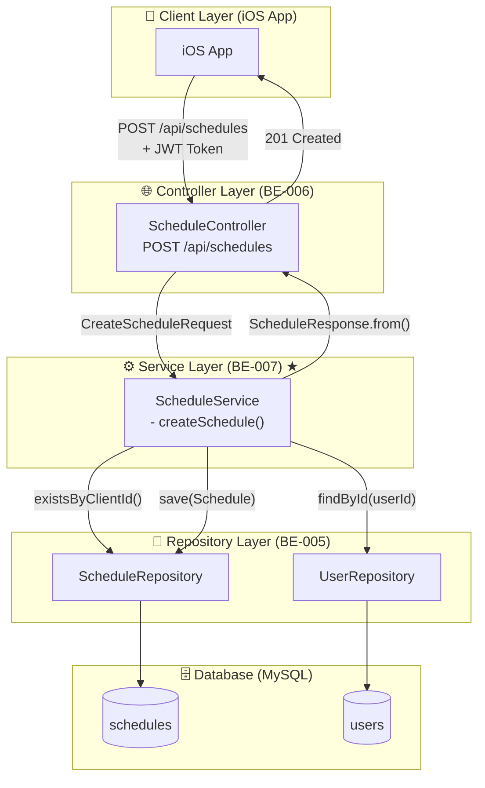
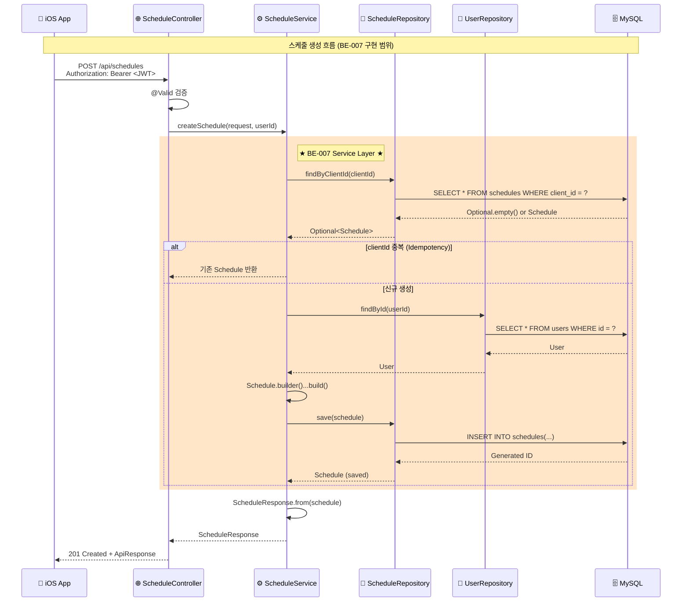

# [BE-007] 스케줄 생성 서비스 로직 구현

**Epic:** EPIC_SCHEDULE_MGMT  
**Priority:** Must  
**Effort:** M (Medium - 2일)  
**Difficulty:** 중  
**Start Date:** 2026-02-07  
**Due Date:** 2026-02-08  
**Dependencies:** BE-005 (Schedule Entity), BE-006 (Schedule API 명세)

---

## 목적 및 요약

- **목적**: 스케줄 생성 API의 비즈니스 로직을 구현하여 3-Tier Architecture의 Service 계층을 완성한다.
- **요약**: `ScheduleService`에서 중복 검사(`clientId`), DTO → Entity 변환, 저장 로직을 구현하고 트랜잭션을 관리한다.

## 관련 스펙 (SRS)

- **ID**: REQ-FUNC-001 (Business Layer)
- **Component**: Backend Logic (Service Layer)

---

## 🔄 CLD (Class/Component Logic Diagram)

> **백엔드 서버 관점**: 데이터가 어떻게 가공될 것인가?

### 3-Tier Architecture Flow



### 데이터 흐름 상세 (Sequence Diagram)



### Component 책임 분리

```
┌─────────────────────────────────────────────────────────────────┐
│                    3-Tier Architecture                          │
├─────────────────┬───────────────────┬───────────────────────────┤
│   Controller    │     Service       │       Repository          │
│   (Interface)   │     (Logic)       │       (Data Access)       │
├─────────────────┼───────────────────┼───────────────────────────┤
│ • HTTP 요청 수신  │ • 비즈니스 로직     │ • DB 쿼리 실행            │
│ • @Valid 검증    │ • 트랜잭션 관리     │ • Entity ↔ Table 매핑     │
│ • DTO 반환       │ • Idempotency     │ • CRUD 메서드 제공        │
│ • JWT 인증 처리   │ • Entity 조합      │ • 쿼리 메서드 정의        │
├─────────────────┼───────────────────┼───────────────────────────┤
│ BE-006 (완료)   │   ★ BE-007 ★     │      BE-005 (완료)        │
└─────────────────┴───────────────────┴───────────────────────────┘
```

---

## API 명세 (BE-006 참조)

### Endpoint

- **Method**: `POST`
- **Path**: `/api/schedules`
- **Auth**: JWT Required (Bearer Token)

### Request Body

```json
{
  "clientId": "550e8400-e29b-41d4-a716-446655440000",
  "name": "아침 공부",
  "duration": 60
}
```

| Field | Type | Required | Validation |
|-------|------|----------|------------|
| clientId | String | ✅ | UUID 형식 (36자) |
| name | String | ✅ | 최대 100자 |
| duration | Integer | ✅ | 1~480분 |

### Response Body (201 Created)

```json
{
  "success": true,
  "data": {
    "id": 1,
    "clientId": "550e8400-e29b-41d4-a716-446655440000",
    "name": "아침 공부",
    "duration": 60,
    "createdAt": "2026-02-07T09:00:00",
    "updatedAt": "2026-02-07T09:00:00"
  },
  "error": null
}
```

### Error Responses

| Status | Code | Message | Condition |
|--------|------|---------|-----------|
| 400 | C001 | 유효하지 않은 입력값 | Validation 실패 |
| 401 | A001 | 인증 실패 | JWT 토큰 없음/만료 |
| 404 | U001 | 사용자를 찾을 수 없음 | userId 조회 실패 |

---

## Sub-Tasks (구현 상세)

### Task 1: ScheduleService 클래스 생성

- [ ] `application/schedule/ScheduleService.java` 생성
- [ ] `@Service`, `@RequiredArgsConstructor`, `@Transactional(readOnly = true)` 적용
- [ ] `ScheduleRepository`, `UserRepository` 주입

### Task 2: createSchedule() 메서드 구현

- [ ] Idempotency 로직: `findByClientId()` 조회 후 기존 데이터 반환
- [ ] User 조회: `userRepository.findById(userId)`
- [ ] Schedule Entity 생성: `Schedule.builder()...build()`
- [ ] 저장: `scheduleRepository.save(schedule)`
- [ ] DTO 변환: `ScheduleResponse.from(schedule)`

### Task 3: Controller 연결

- [ ] `ScheduleController`에 `ScheduleService` 주입
- [ ] `createSchedule()` 메서드에서 서비스 호출
- [ ] `@AuthenticationPrincipal` 또는 JWT에서 userId 추출

### Task 4: Exception 처리

- [ ] `USER_NOT_FOUND` ErrorCode 추가 (필요 시)
- [ ] `BusinessException` 또는 커스텀 예외 사용

---

## 비즈니스 로직 상세

### Idempotency 처리

```java
// 동일한 clientId로 요청이 오면 기존 데이터를 반환 (에러가 아님)
Optional<Schedule> existing = scheduleRepository.findByClientId(request.clientId());
if (existing.isPresent()) {
    log.info("Idempotency: 기존 스케줄 반환 - clientId={}", request.clientId());
    return ScheduleResponse.from(existing.get());
}
```

### Entity 생성

```java
User user = userRepository.findById(userId)
    .orElseThrow(() -> new BusinessException(ErrorCode.USER_NOT_FOUND));

Schedule schedule = Schedule.builder()
    .clientId(request.clientId())
    .name(request.name())
    .duration(request.duration())
    .user(user)
    .build();

Schedule saved = scheduleRepository.save(schedule);
```

### 트랜잭션 관리

- 클래스 레벨: `@Transactional(readOnly = true)` - 읽기 전용 기본값
- `createSchedule()` 메서드: `@Transactional` - 쓰기 작업

---

## Definition of Done (DoD)

### 기능 요구사항

- [ ] **ScheduleService 클래스 생성**: `application/schedule/` 패키지에 생성
- [ ] **Idempotency**: 동일한 `clientId`로 요청 시 기존 데이터를 반환 (에러 아님)
- [ ] **User 조회**: JWT에서 추출한 userId로 User 엔티티 조회
- [ ] **Schedule 저장**: DTO → Entity 변환 후 DB 저장
- [ ] **DTO 반환**: Entity → ScheduleResponse 변환

### 트랜잭션 요구사항

- [ ] `@Transactional` 적용
- [ ] 저장 실패 시 롤백 확인 (테스트)

### 테스트 요구사항

- [ ] **Unit Test**: ScheduleService 단위 테스트 (Mockito)
- [ ] **Integration Test**: Controller → Service → Repository E2E 테스트

---

## 테스트 전략

### Unit Test (ScheduleServiceTest)

| 테스트 케이스 | 검증 내용 |
|--------------|----------|
| 정상 생성 | 새 스케줄 생성 및 저장 확인 |
| Idempotency | 동일 clientId로 요청 시 기존 데이터 반환 |
| User 없음 | USER_NOT_FOUND 예외 발생 |

### Integration Test (ScheduleControllerIntegrationTest)

| 테스트 케이스 | 검증 내용 |
|--------------|----------|
| POST 201 | JWT 인증 후 스케줄 생성 성공 |
| POST 401 | JWT 없이 요청 시 인증 실패 |
| Validation 400 | 잘못된 입력값 검증 |

---

## 파일 구조 (예상)

```
src/main/java/com/wombat/screenlock/unwind_be/
├── api/schedule/
│   ├── controller/
│   │   └── ScheduleController.java     # 수정 (Service 연결)
│   └── dto/
│       ├── CreateScheduleRequest.java  # ✅ 이미 존재
│       └── ScheduleResponse.java       # ✅ 이미 존재
├── application/
│   ├── auth/
│   │   └── AuthService.java            # ✅ 이미 존재
│   └── schedule/
│       └── ScheduleService.java        # 🆕 신규 생성
└── ...

src/test/java/com/wombat/screenlock/unwind_be/
└── application/schedule/
    └── ScheduleServiceTest.java         # 🆕 신규 생성
```

---

## 구현 힌트

1. **AuthService 참조**: `application/auth/AuthService.java` 패턴 따라 구현
2. **ErrorCode 확인**: `USER_NOT_FOUND` 에러 코드 필요 시 추가
3. **JWT userId 추출**: `JwtProvider.getUserIdFromToken()` 활용 또는 `@AuthenticationPrincipal`
4. **Logging**: 주요 비즈니스 로직에 `log.info()` 추가

---

## 관련 이슈 참조

| Issue | Title | 관계 |
|-------|-------|------|
| BE-005 | Schedule Entity 데이터 모델링 | ✅ 선행 완료 |
| BE-006 | 스케줄 생성 API 명세 | ✅ 선행 완료 |
| BE-008 | 스케줄 동기화 API | 후속 (BE-007 완료 필요) |
| BE-009 | 스케줄 수정/삭제 API | 후속 (BE-007 완료 필요) |

---

**Labels:** `backend`, `must`, `phase-2`  
**Milestone:** v1.0-MVP

